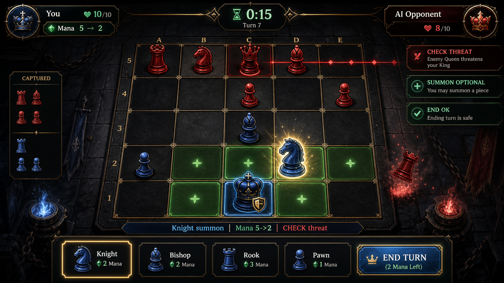

## 2026-06-22 Update: Board and Piece Quality Pass

- Version: `v0.2.24`
- Preserved the original chess-piece PNGs under `public/assets/pieces/source` and added `scripts/normalize_piece_assets.cjs` so piece silhouettes are regenerated from source with larger visible height and consistent bottom alignment.
- Added `game-piece-shadow.png` and routed both GameScene and PlacementScene through bitmap piece shadows instead of visible runtime ellipse shadows.
- Updated PlacementScene to use the same generated board cell PNG skins as the in-game board, reducing the tone mismatch between pre-battle placement and combat.
- Recovered the corrupted UI copy block in `src/ui/visuals.js` to normal Korean release text and covered the board/piece skin pipeline with VisualTheme regression checks.

---
## 2026-06-19 Update: Action Feedback Quality Pass

- Version: `v0.2.23`
- Added a compact action-feedback line after player move, capture, and summon actions so the HUD immediately confirms what happened.
- The feedback also states the remaining action slot, reducing uncertainty around the one-move plus one-summon turn rule.
- Added regression coverage for action feedback copy and wired the player-action event payload to carry action context.

---

## 2026-06-19 Update: Summon Card Size Fill

- Version: `v0.2.23`
- Increased summon card width and height from 76x118 to 78x122 so the lower HUD uses its available space more fully.
- Raised the summon piece icon to 53px and enlarged card name/cost presentation while preserving mana gauge and footer button clearance.
- Added layout assertions so the five-card row remains tight without overflowing the HUD panel.

---

## 2026-06-19 Update: In-Game Vector-Looking Skin Replacement

- Version: `v0.2.23`
- Replaced always-visible in-game board cells, fog cells, move/selected/movable/threat/summon highlights, mana crystals, and clock chips with generated PNG skins.
- Updated `GameScene` and `UIScene` so these surfaces no longer depend on visible Phaser shape artwork during normal runtime.
- Added global workspace guidance to audit SVG-looking runtime primitives, not only literal `.svg` files, across all projects.

---

## 2026-06-19 Update: Resource Tone Alignment

- Version: `v0.2.23`
- Regenerated compact brand mark, all MMR tier badges, result trophy, and the legacy summon-card frame as dark metal/gold/cyan PNG assets.
- Routed these assets through `scripts/generate_ui_frames.cjs` so they share the same frame, gem, highlight, and texture language as the current HUD.
- Raised brand/rank/result/summon-frame tests so tiny flat PNG replacements fail before release packaging.

---

## 2026-06-18 ?낅뜲?댄듃: SVG ?고???由ъ냼??PNG 援먯껜

- 踰꾩쟾: `v0.2.23`
- 硫붾돱/寃뚯엫 HUD/踰꾪듉/?뚰솚 移대뱶/留덈굹 ?꾨젅?꾩뿉???⑥븘 ?덈뜕 SVG 李몄“瑜?湲곗〈 怨좏뭹吏?PNG ?꾨젅?꾩쑝濡??щℓ?묓뻽??
- 釉뚮옖??蹂댁“ 留덊겕?€ MMR ?곗뼱 諛곗?瑜?PNG ?먯궛?쇰줈 ?앹꽦?섍퀬 `rankTiers`, 由ъ냼??紐⑸줉, 寃€利??뚯뒪?몃? ?④퍡 媛깆떊?덈떎.
- Boot ?꾨━濡쒕뱶??UI ?먯궛??紐⑤몢 ?대?吏€濡?濡쒕뱶?섎룄濡??뺣━?덈떎.

---

# Chess of Dark 湲고쉷??
**Version:** 0.2.24  
**?묒꽦??** 2026-05-12  
**Last Updated:** 2026-06-22  
**?λⅤ:** ?붿????꾨왂 / 泥댁뒪 蹂€??
---


---

## ?뚮젅??誘몃━蹂닿린

### ?뚮젅??誘몃━蹂닿린


---
## 1. 寃뚯엫 媛쒖슂

Chess of Dark??5x5 泥댁뒪?먯뿉??留먯쓣 吏€?ㅻʼn 留덈굹濡??덈줈??留먯쓣 ?뚰솚?섎뒗 ?꾩닠 寃뚯엫?대떎. ?뚮젅?댁뼱???쒗븳???쒖빞?€ 3遺?泥댁뒪 ?쒓퀎 ?덉뿉???대룞 1踰? ?뚰솚 1踰덉쓣 ?좏깮?섍퀬, ?뚰솚 ?꾩튂瑜??뺣낫???꾩꽭瑜??ㅼ쭛?댁빞 ?쒕떎.

### ?듭떖 ?щ?

- 留덈굹瑜?紐⑥븘 ?대뼡 留먯쓣 ?몄젣 ?뚰솚?좎? ?먮떒?섎뒗 ?좏깮
- ?쒗븳??蹂대뱶?먯꽌 留???嫄곗젏???뺣낫?섎뒗 ?뺣컯
- ?덇컻媛€ 嫄룻엳???쒖빞 ?뺣낫瑜?異붾줎?섎뒗 ?꾩닠??- 3遺?泥댁뒪 ?쒓퀎?€ 臾댁엯??寃쎄퀬濡??앷린???쒓컙 愿€由??뺣컯

---

## 2. 湲곕낯 洹쒖튃

- 蹂대뱶: 5x5
- 紐⑤뱶: ?깃? ?뚮젅?댁뼱 vs AI, ?⑤씪??硫€???뚮젅??濡쒕퉬
- ?밸━ 議곌굔: ?곷? ???ы쉷 ?먮뒗 泥댄겕硫붿씠??- ???쒖옉 ??留덈굹 +2, 理쒕? 10
- ???댁뿉 ?대룞 1踰? ?뚰솚 1踰?媛€??- ?쒗븳?쒓컙?€ 泥댁뒪 ?쒓퀎泥섎읆 ?묒そ??媛곴컖 3遺꾩쓣 媛€吏€怨? ?먭린 ???숈븞留?媛먯냼?쒕떎.
- ?뚮젅?댁뼱媛€ ?먭린 ?댁뿉 30珥??숈븞 ?낅젰?섏? ?딆쑝硫?寃쎄퀬 ?앹뾽???⑤ʼn, `議곌툑 ???앷컖?쒕떎`瑜?怨좊Ⅴ吏€ ?딆쑝硫?利됱떆 ?⑤같?쒕떎.
- ?쒓컙??0珥덇? ???뚮젅?댁뼱???쒓컙?⑦븳??
- ?먭린 ???쒖옉 ???⑥? ?쒓컙??10珥??댄븯?쇰㈃ 10珥덇퉴吏€ 異⑹쟾?섏뼱 理쒖냼 ?됰룞 ?쒓컙??蹂댁옣?쒕떎.

### ?쒖옉 諛곗튂

```text
0??[ . ][ . ][AI ??[ . ][ . ]
1??[AI 蹂?[AI 蹂?[ . ][AI 蹂?[AI 蹂?
2??[ . ][ . ][ . ][ . ][ . ]
3??[ . ][ . ][ . ][ . ][ . ]
4??[ . ][ . ][PL ??[ . ][ . ]
```

?ъ옄?€ 蹂댄넻?€ 蹂묒궗 4紐낆쓣 ?먮룞 諛곗튂?쒕떎. ?대젮?€怨?留ㅼ슦 ?대젮?€?€ ?섎떒 2媛??됱뿉 蹂묒궗 4紐낆쓣 吏곸젒 諛곗튂?쒕떎.

---

## 3. 留덈굹?€ ?뚰솚

| 留?| 湲곕낯 鍮꾩슜 |
| --- | ---: |
| 蹂묒궗 | 1 |
| 湲곗궗 | 3 |
| 二쇨탳 | 3 |
| ?깆콈 | 5 |
| ?ъ솗 | 8 |

媛숈? 醫낅쪟瑜?諛섎났 ?뚰솚?좎닔濡?鍮꾩슜?€ 2??利앷??쒕떎. ?뚰솚?€ ?꾧뎔 留?二쇰? 8移몄쓽 鍮?移몄뿉留?媛€?ν븯硫? ?뚰솚??留먯? ?대떦 ?댁뿉 ?대룞?????녿떎.

---

## 4. UI / UX 蹂€寃??대젰

### v0.2.17 寃곌낵 ?붾㈃ ?몃줈???꾩씠肄섍낵 ?먯닔 ?꾨젅???뺣━
- 寃곌낵 ?붾㈃??`SINGLE MMR` ?띿뒪???쇰꺼???쒓굅?섍퀬 `result-trophy.png` ?몃줈???꾩씠肄섏쓣 ?앹꽦???먯닔 ?곷떒???쒖떆?쒕떎.
- 寃곌낵 ?먯닔 ?꾨젅?꾩쓣 388x316?쇰줈 ?ㅼ슦怨?吏꾪뻾 ?띿뒪???꾩튂瑜??꾨옒履쎌쑝濡??뺣━???먯닔, 利앷컧移? ?댁쟾 ?먯닔 ?쒓린媛€ ?꾨젅??諛뽰쑝濡?鍮좎졇?섍?吏€ ?딄쾶 ?덈떎.
- `scripts/generate_ui_frames.cjs`?먯꽌 寃곌낵 ?몃줈???꾩씠肄섎룄 ?④퍡 ?ъ깮?깅릺?꾨줉 異붽??덈떎.

### v0.2.16 寃곌낵 ?붾㈃ 踰꾪듉 ?띿뒪???꾩튂 議곗젙
- 寃곌낵 ?붾㈃??`?ㅼ떆?섍린`?€ `硫붿씤 硫붾돱` 踰꾪듉 ?띿뒪?몃? 6px ??떠 ?€?댄? 踰꾪듉 ?꾨젅?꾩쓽 ?쒓컖 以묒떖????媛€源앷쾶 留욎톬??
- ??踰꾪듉 紐⑤몢 `textOffsetY: 2`瑜?紐낆떆???ㅻⅨ title 踰꾪듉 湲곕낯 蹂댁젙媛믨낵 遺꾨━??寃곌낵 ?붾㈃ ?꾩슜 ?꾩튂瑜??좎??쒕떎.

### v0.2.15 ?멸쾶??HUD ?꾨젅??由ъ냼???ъ깮??- `chesssummon-ingame-entry-mockup-v0.1.53.png` ?덉떆 ?대?吏€???곷떒 ?€???뺣낫?? ?섎떒 移대뱶/留덈굹/?≪뀡 ?곸뿭 ?꾧퀎瑜?李멸퀬???멸쾶??HUD PNG ?꾨젅?꾩쓣 ?덈줈 ?앹꽦?덈떎.
- `game-bottom-hud-frame.png`瑜?異붽????섎떒 ?뚰솚/留덈굹/踰꾪듉 ?곸뿭??肄붾뱶 ?⑤꼸???꾨땲???ㅽ겕 硫뷀깉/怨⑤뱶 踰좊꺼 ?꾨젅??由ъ냼?ㅻ줈 ?쒖떆?쒕떎.
- `game-top-hud-frame.png`, `game-summon-tile-frame.png`, `game-mana-frame.png`, `game-action-button-frame.png`瑜?媛숈? ?앹꽦 ?ㅽ겕由쏀듃 湲곗??쇰줈 媛깆떊???곷떒/?섎떒 HUD ?ㅼ쓣 留욎톬??
- ?뚰솚 移대뱶??76x118濡??ㅼ슦怨??섎떒 ?⑤꼸 ?꾩껜 ??쓣 ???볤쾶 ?ъ슜?섎룄濡?移대뱶 媛꾧꺽??4px ?섏??쇰줈 以꾩뿬 ?덉떆 ?대?吏€泥섎읆 5??移대뱶媛€ ??臾듭쭅?섍쾶 蹂댁씠寃??덈떎.

### v0.2.14 硫€??濡쒕퉬 濡쒓퀬?€ AI ?€泥?留ㅼ묶 蹂댁젙
- 硫€?고뵆?덉씠 濡쒕퉬 ?곷떒??`?⑤씪??硫€???뚮젅?? ?띿뒪???€?댄????쒓굅?섍퀬 ?쒖옉 ?붾㈃怨?媛숈? `Chess of Dark` 濡쒓퀬瑜??쒖떆?쒕떎.
- 鍮좊Ⅸ 留ㅼ묶?€ ?쒕쾭媛€ ?곌껐?섏? ?딆븯嫄곕굹 ?뺥빐吏??쒓컙 ?덉뿉 ?멸컙 ?곷?瑜?李얠? 紐삵빐??利됱떆 AI ?€泥?留ㅼ묶?쇰줈 ?댁뼱???몄젣???뚮젅?댄븷 ???덈떎.
- AI ?€泥?留ㅼ묶?€ ?꾩옱 MMR??湲곗??쇰줈 ?쒖씠?꾨? 怨좊Ⅴ?? ?섎（ 泥?AI ?€泥?留ㅼ묶?€ -120 MMR 蹂댁젙?쇰줈 ?쎄컙 ?ъ슫 ?곷?瑜?遺숈씠怨???踰덉㎏ ?먮??곕뒗 +180 MMR 蹂댁젙?쇰줈 ?쎄컙 ?대젮???곷?瑜?遺숈씤??

### v0.2.13 ?쒖씠??踰꾪듉 臾멸뎄 ?꾩튂?€ ?좉툑 ?곹깭 議곗젙
- ?쒖씠??踰꾪듉 ?덉쓽 ?쒖씠?꾨챸?€ 踰꾪듉 以묒떖蹂대떎 4px ?꾨옒, ?ㅻ챸 臾멸뎄??36px ?꾨옒濡??대젮 `?먮룞 諛곗튂 + ?쒗넗由ъ뼹 ?좏깮` 媛숈? 湲?臾멸뎄媛€ ?꾨젅???덉そ?????덉젙?곸쑝濡?蹂댁씠寃??덈떎.
- ?좉릿 `留ㅼ슦 ?대젮?€` 踰꾪듉?€ `enabled: false` ?곹깭瑜??곸슜??踰꾪듉 ?꾨젅?? ?띿뒪?? ?됱긽???④퍡 ?ㅻ뱶 泥섎━?섎룄濡?蹂€寃쏀뻽??
- ?좉툑 ?덈궡 臾멸뎄??鍮④컙 寃쎄퀬???€??DIM ?띿뒪???됱긽???ъ슜???좏깮 遺덇? ?곹깭濡??쏀엳寃??덈떎.

### v0.2.12 寃곌낵 ?붾㈃ ?깃? MMR ?곗텧
- 寃곌낵 ?붾㈃?먯꽌 ?곷떒 寃뚯엫紐? ?뱁뙣 臾멸뎄, ?몃? ?⑤같/?밸━ ?ъ쑀, `KING CAPTURED` 媛숈? 寃곌낵 ?ㅻ챸 ?띿뒪?몃? ?쒓굅?덈떎.
- 寃곌낵 ?붾㈃??以묒떖 ?뺣낫瑜?`SINGLE MMR`, ?꾩옱 ?먯닔, 利앷컧移? ?댁쟾 ?먯닔?먯꽌 ?꾩옱 ?먯닔濡??대룞?섎뒗 ?쒓린濡??⑥닚?뷀뻽??
- ?깃? ?뚮젅??寃곌낵??濡쒖뺄 `chesssummon.singleMmr` ?먯닔??諛섏쁺?섎ʼn, ?밸━ ??+12?먯쑝濡?理쒕? 1200?먭퉴吏€留??곸듅?섍퀬 ?⑤같 ??-10???섎씫?쒕떎.
- PVP 寃곌낵???깃? MMR??蹂€寃쏀븯吏€ ?딅룄濡?`multiplayerMode`瑜?Result ?붾㈃源뚯? ?꾨떖?쒕떎.
- ?⑤같 ??MMR ?섎씫 ?섏튂媛€ ?꾨옒濡??⑥뼱吏€??吏㏃? ?곗텧??異붽??덈떎.

### v0.2.11 ?멸쾶???섎떒 ?≪뀡 踰꾪듉 ?뺣?
- `chesssummon-ingame-entry-mockup-v0.1.53.png` ?덉떆 ?대?吏€???섎떒 ?€???≪뀡 踰꾪듉 鍮꾩쑉??李멸퀬???멸쾶??`??醫낅즺`?€ `湲곌텒` 踰꾪듉 ?믪씠瑜?60px濡??ㅼ썱??
- `??醫낅즺` 踰꾪듉?€ 238px ??낵 18px 湲€?먮줈 媛뺤“?섍퀬, `湲곌텒` 踰꾪듉?€ 112px ??쑝濡??좎???二쇱슂 ?됰룞怨?蹂댁“ ?됰룞???꾧퀎瑜?遺꾨━?덈떎.
- ?쒗넗由ъ뼹???섎떒 踰꾪듉 ?섏씠?쇱씠???곸뿭??而ㅼ쭊 踰꾪듉 ?ш린??留욎떠 ?뺤옣?덈떎.

### v0.2.10 蹂대뱶 留??믪씠 議곗젙
- ?멸쾶??蹂대뱶 留먯쓽 怨듯넻 ?섎떒 湲곗??좎쓣 6px ?꾨줈 ?щ젮 留먯씠 蹂대뱶 移??덉뿉??????蹂댁씠吏€ ?딄퀬 ?덉젙?곸쑝濡??먮━ ?↔쾶 ?덈떎.
- 諛곗튂 ?붾㈃??留??대?吏€??媛숈? `PIECE_BOARD_LIFT` 湲곗????ъ슜???멸쾶??蹂대뱶?€ ?몃줈 ?꾩튂媛먯쓣 留욎톬??
- ?대룞 ?좊땲硫붿씠????떆 媛숈? ?뚮뜑 ?꾩튂 怨꾩궛???ъ슜?섎?濡??뺤?/?대룞 以?留??믪씠媛€ ?쇨??섍쾶 ?좎??쒕떎.

### v0.2.9 留ㅼ묶/?ㅻ줈 踰꾪듉 ?띿뒪???꾩튂 議곗젙
- 硫€?고뵆?덉씠 濡쒕퉬??`鍮좊Ⅸ 留ㅼ묶`怨?`?ㅻ줈` 踰꾪듉 ?띿뒪?몃? 6px ?꾨옒濡??대젮 ?€?댄? ?꾨젅??以묒븰????媛€源앷쾶 留욎톬??
- ?쒖씠???붾㈃??`?ㅻ줈` 踰꾪듉 ?띿뒪?몃룄 媛숈? 湲곗??쇰줈 ??떠 硫붾돱 怨꾩뿴 踰꾪듉???몃줈 ?뺣젹???듭씪?덈떎.

### v0.2.8 ?쒖씠??踰꾩쟾 ?쒓린 ?꾩튂 議곗젙
- ?쒖씠??踰꾪듉 ?덉쓽 ?쒖씠?꾨챸怨??ㅻ챸 臾멸뎄瑜?媛곴컖 6px ?꾨옒濡??대젮 踰꾪듉 ?꾨젅???덉뿉?????덉젙?곸쑝濡?蹂댁씠寃??덈떎.
- ?쒖옉/?쒖씠???붾㈃???섎떒 諛곗???`Desktop v...` ?€??`v...`留??쒖떆?섎룄濡?蹂€寃쏀뻽??
- 踰꾩쟾 ?쒓린 ?꾩튂瑜??붾㈃ ?섎떒 16px 湲곗??쇰줈 ?대젮, 硫붾돱 踰꾪듉怨?遺꾨━??由대━???뺣낫泥섎읆 蹂댁씠寃??덈떎.

### v0.2.7 ?쒖옉 ?붾㈃ 濡쒓퀬 ?꾩튂 議곗젙
- ?쒖옉 ?붾㈃??`Chess of Dark` 濡쒓퀬 以묒떖 Y ?꾩튂瑜?165px?먯꽌 180px濡??대젮, ?곷떒 ?щ갚怨?踰꾪듉 ?곸뿭 ?ъ씠???쒓컖??洹좏삎??議곗젙?덈떎.

### v0.2.6 硫붾돱 怨꾩뿴 ?붾㈃ ???듭씪
- 諛곗튂 ?붾㈃, ?쒗넗由ъ뼹 ?뺤씤 ?앹뾽, 硫€?고뵆?덉씠 濡쒕퉬, 寃곌낵 ?붾㈃???쒖옉 ?붾㈃怨?媛숈? `title-background.png` 湲곕컲 諛곌꼍???곗꽑 ?ъ슜?섎룄濡??뺣━?덈떎.
- 諛곗튂 ?붾㈃ 以€鍮?踰꾪듉, ?쒗넗由ъ뼹 ?좏깮 踰꾪듉, 硫€??濡쒕퉬 踰꾪듉, 寃곌낵 ?붾㈃ 踰꾪듉??`title-button-frame.png` 湲곕컲 湲덉냽 ?꾨젅?꾩쑝濡??듭씪?덈떎.
- 諛곗튂 ?붾㈃??蹂대뱶 ?멸낸?€ `game-board-frame.png`瑜??ъ슜???멸쾶??蹂대뱶?€ 媛숈? 由ъ냼??泥닿퀎濡?留욎톬??
- 寃곌낵 ?붾㈃???먯쑝濡?洹몃┛ ?뺢?/?⑤꼸 ?μ떇???쒓굅?섍퀬 ?쒖옉 ?붾㈃怨?媛숈? ?대몢??湲덉냽 ?꾨젅??以묒떖??寃곌낵 ?곗텧濡?蹂€寃쏀뻽??

### v0.2.5 ?멸쾶??蹂대뱶 ?꾨젅???대?吏€ 由ъ냼???곸슜
- ?고???Phaser graphics濡?洹몃━???멸쾶??蹂대뱶 ?멸낸 ?꾨젅?꾩쓣 `public/assets/ui/game-board-frame.png` ?대?吏€ 由ъ냼?ㅻ줈 ?앹꽦???곸슜?덈떎.
- `scripts/generate_ui_frames.cjs`瑜?異붽???蹂대뱶 ?꾨젅??PNG瑜??ъ깮?깊븷 ???덇쾶 ?덈떎.
- `UI_ASSETS.gameBoardFrame`怨?Boot preload瑜??듯빐 蹂대뱶 ?꾨젅?꾩쓣 ?뺤떇 UI ?먯궛?쇰줈 愿€由ы븳??
- ?띿뒪泥섍? ?놁쓣 ?뚮쭔 湲곗〈 肄붾뱶 ?쒕줈???꾨젅?꾩쑝濡?fallback?섎룄濡??좎??덈떎.

### v0.2.4 ?멸쾶??留??섎떒 湲곗????뺣젹
- 蹂대뱶 ??留??대?吏€瑜??€ 以묒븰 湲곗????꾨땲???섎떒 湲곗??좎뿉 留욎떠 ?뚮뜑留곹븯?꾨줉 議곗젙?덈떎.
- 蹂묒궗?€ ?€??留먯쓽 ?쒖떆 ?ш린媛€ ?щ씪??媛숈? ?됱뿉??留먯쓽 留??꾨옒 ?믪씠媛€ ?쇱튂?쒕떎.
- ?대룞 ?좊땲硫붿씠?섎룄 ?숈씪???섎떒 湲곗? ?뚮뜑 ?꾩튂瑜??ъ슜???대룞 以??대룞 ???꾩튂媛€ ?€吏€ ?딅룄濡??덈떎.
- GameScene ?뚭? ?뚯뒪?몄뿉 ?????섎떒 y醫뚰몴 ?쇱튂 寃€利앹쓣 異붽??덈떎.

### v0.2.3 ?쒖옉 ?붾㈃ 紐⑤뱶 踰꾪듉 ?띿뒪???꾩튂 ?ъ“??- `?깃? ?뚮젅??, `硫€???뚮젅?? ?띿뒪?몃? ?€?댄? 踰꾪듉 ?꾨젅??以묒떖?좎뿉 留욎떠 4px ?꾨옒濡??대졇??
- ?쒖씠???좏깮 踰꾪듉??2以??띿뒪??蹂댁젙?€ ?좎????쒖옉 ?붾㈃ 紐⑤뱶 踰꾪듉留?蹂꾨룄 ?꾩튂媛믪쓣 ?ъ슜?쒕떎.
- MenuFlow ?뚭? ?뚯뒪?몄쓽 ?쒖옉 ?붾㈃ 踰꾪듉 ?띿뒪??y醫뚰몴瑜?媛깆떊?덈떎.

### v0.2.2 踰꾪듉 ?띿뒪???꾩튂 蹂댁젙
- ?€?댄? 踰꾪듉 ?꾨젅?꾩쓽 ?쒓컖 以묒떖??留욎떠 怨듯넻 踰꾪듉 ?띿뒪?몃? ?꾨줈 蹂댁젙?덈떎.
- ?쒖씠???좏깮 踰꾪듉???쒖씠?꾨챸/?ㅻ챸 2以?諛곗튂瑜??ъ“?뺥빐 湲€?먭? ?꾨젅???μ떇??遺숈뼱 蹂댁씠吏€ ?딅룄濡??섏젙?덈떎.
- MenuFlow ?뚭? ?뚯뒪?몄뿉 ?쒖옉/?쒖씠??踰꾪듉 ?띿뒪??y醫뚰몴 寃€利앹쓣 異붽??덈떎.

### v0.2.1 ?쒖옉 硫붾돱 紐⑤뱶 ?좏깮 怨좎젙
- ?쒖옉 ?붾㈃??鍮뚮뱶 梨꾨꼸怨?臾닿??섍쾶 ??긽 ?깃? ?뚮젅??硫€???뚮젅???좏깮??癒쇱? 蹂댁뿬二쇰룄濡??섏젙?덈떎.
- 湲곗〈?먮뒗 Steam 梨꾨꼸?먯꽌留?紐⑤뱶 ?좏깮???섏삤怨?Desktop/HTML 湲곕낯 鍮뚮뱶?먯꽌??諛붾줈 ?쒖씠???좏깮?쇰줈 吏꾩엯?덈떎.
- MenuFlow ?뚭? ?뚯뒪?몃? 媛깆떊??紐⑤뱺 由대━利?梨꾨꼸?먯꽌 紐⑤뱶 ?좏깮???좎??섎룄濡?怨좎젙?덈떎.

### v0.2.0 ?쒕쾭 沅뚯쐞 PvP 留ㅼ묶 寃쎈줈 異붽?
- ??紐낆쓽 ?€湲곗뿴 ?좎?媛€ 留ㅼ묶?섎㈃ ?쒕쾭媛€ pvpSession???앹꽦?섍퀬 蹂대뱶 ?곹깭, ?? 留덈굹, 寃곌낵瑜??뚯쑀?쒕떎.
- ?대씪?댁뼵?멸? ?꾩쓽 ?뱀옄瑜?蹂대궡??湲곗〈 matchResult 寃쎈줈瑜?留됯퀬, ?쒕쾭媛€ ?앹꽦??resign/disconnect/king capture 寃곌낵濡쒕쭔 ??겕 ?먯닔瑜?媛깆떊?쒕떎.
- Electron Steam ID bridge?€ WebSocket steamId query瑜?異붽???Steam 怨꾩젙 湲곕컲 留ㅼ묶/??겕 ?앸퀎 寃쎈줈瑜?留덈젴?덈떎.
- 濡쒕퉬??pvpState瑜?諛쏆쑝硫?Game ?ъ쑝濡?吏꾩엯?섍퀬, GameScene?€ ?대룞/?뚰솚/??醫낅즺瑜?pvpCommand濡??쒕쾭??蹂대궡硫??쒕쾭 ?ㅻ깄?룹쑝濡?蹂대뱶瑜?蹂듭썝?쒕떎.

### v0.1.95 ?쒖옉 ?붾㈃ 濡쒓퀬 ?꾩튂 議곗젙
- ?쒖옉/?쒖씠???붾㈃??怨듯넻 釉뚮옖??濡쒓퀬 以묒떖 y醫뚰몴瑜?150?먯꽌 165濡???떠 ?곷떒??遺숈뼱 蹂댁씠???먮굦??以꾩???
- 湲곗〈 410x205 濡쒓퀬 ?ш린?€ 踰꾪듉 諛곗튂???좎???踰꾪듉 ?곸뿭??媛€?낆꽦怨??곗튂 ?щ갚?€ ?붾뱾由ъ? ?딄쾶 ?덈떎.

### v0.1.94 Multiplayer/MMR 異쒖떆 ?먮떒 ?뺣━
- `src/multiplayer/releaseReadiness.js`瑜?異붽???AI ?€泥?留ㅼ묶, 濡쒖뺄 MMR ?€?? Steam `RANK_POINTS` ?낅줈???대뙌?곗? ?ㅼ젣 怨듦컻 PvP ??겕??李⑥씠瑜??뚯뒪??媛€?ν븳 湲곗??쇰줈 遺꾨━?덈떎.
- ?꾩옱 1李?Steam 異쒖떆 踰붿쐞???깃? ?뚮젅?댁? AI ?€泥?留ㅼ묶/??궧 ?꾨━酉곌퉴吏€媛€ ?덉쟾?섎ʼn, ???좎?媛€ ?ㅼ젣濡?蹂대뱶瑜??숆린?뷀븯??怨듦컻 ??겕 PvP???쒕쾭 沅뚯쐞 蹂대뱶 ?곹깭, Steam ID 怨꾩젙 留ㅽ븨, ?쒕쾭 寃€利?寃곌낵 泥섎━媛€ 異붽????뚭퉴吏€ 蹂대쪟?쒕떎.
- `docs/Multiplayer_MMR_異쒖떆_?먮떒.md`???꾩옱 媛€?ν븳 踰붿쐞, ?⑥? blocker, 異붿쿇 異쒖떆 踰붿쐞瑜?蹂꾨룄 臾몄꽌濡??뺣━?덈떎.

### v0.1.93 Steam ?ㅽ넗???먯궛 ?⑦궎吏€ 湲곗? ?뺣━
- Steamworks 怨듭떇 洹몃옒???먯궛 湲곗???留욎떠 `src/steam/storeAssets.js`???꾩닔 罹≪뒓/?ㅽ겕由곗꺑/?쇱씠釉뚮윭由??먯궛 ?ш린 移댄깉濡쒓렇瑜?異붽??덈떎.
- `docs/Steam_?ㅽ넗???쒖텧_?⑦궎吏€.md`瑜?異붽???罹≪뒓 ?쒖옉 諛⑺뼢, 16:9 ?ㅽ겕由곗꺑 ??由ъ뒪?? 15-30珥??몃젅?쇰윭 援ъ꽦, ?쒓뎅???곸뼱 ?ㅽ넗??臾멸뎄 珥덉븞???뺣━?덈떎.
- Steam ?ㅽ넗???먯궛 ?ш린媛€ 諛붾€뚯뼱???뚭? ?뚯뒪?몃줈 ?꾩닔 ?ш린 湲곗????뺤씤?????덇쾶 ?덈떎.

### v0.1.92 Steam ?쒖텧 以€鍮?泥댄겕由ъ뒪???먮룞??- `src/steam/releaseReadiness.js`瑜?異붽????꾩옱 踰꾩쟾 ?곗텧臾쇰챸, ?낆쟻/?ㅽ꺈/由щ뜑蹂대뱶 移댄깉濡쒓렇, Steamworks/?ㅽ넗???섎룞 QA blocker瑜???踰덉뿉 怨꾩궛?섍쾶 ?덈떎.
- `docs/Steam_?쒖텧_QA_泥댄겕由ъ뒪??md`瑜?異붽???Steam ?쒖텧 吏곸쟾 ?뺤씤??鍮뚮뱶 ?곗텧臾? ?몃? Steamworks ?ㅼ젙, ?ㅽ넗???먮즺, ?섎룞 QA ??ぉ???뺣━?덈떎.
- Steam 異쒖떆 ?꾨줈?몄뒪瑜??덈?以묒씠 ?꾨땲???뚯뒪??媛€?ν븳 泥댄겕由ъ뒪?몃줈 ?댁뼱媛????덈룄濡??뚭? ?뚯뒪?몃? 異붽??덈떎.

### v0.1.91 留ㅼ슦 ?대젮?€ ?좉툑 踰꾪듉 ?묒떇 ?듭씪
- ?좉툑 ?곹깭??`留ㅼ슦 ?대젮?€`???ㅻⅨ ?쒖씠?꾩? ?숈씪??92px ?€?댄? 踰꾪듉 ?꾨젅???곗깋 ?쒖씠?꾨챸/踰꾪듉 ?대? ?덈궡 臾멸뎄 ?묒떇?쇰줈 蹂댁씠寃??덈떎.
- ?닿툑 ?꾩뿉???ъ쟾??諛곗튂 ?붾㈃?쇰줈 吏꾩엯?섏? ?딆?留? ?뚯깋 諛섑닾紐?踰꾪듉泥섎읆 遺꾨━?섏뼱 蹂댁씠吏€ ?딅룄濡??쒓컖 ?곹깭留??듭씪?덈떎.

### v0.1.90 ?쒖씠???좏깮 踰꾪듉 ?대? ?ㅻ챸 諛곗튂
- ?깃? ?뚮젅???좏깮 ???쒖씠???좏깮 ?붾㈃?먯꽌 ?곷떒??`?깃? ?뚮젅??, `?쒖씠?꾨? ?좏깮?섏꽭?? 臾멸뎄瑜???젣??濡쒓퀬 ?꾨옒 ?쒖꽑??踰꾪듉?쇰줈 諛붾줈 蹂대궡?꾨줉 ?뺣━?덈떎.
- ?쒖씠??踰꾪듉 ?믪씠瑜?74px?먯꽌 92px濡??ㅼ슦怨?媛??쒖씠???ㅻ챸/?닿툑 臾멸뎄瑜?踰꾪듉 ?대? ??踰덉㎏ 以꾨줈 諛곗튂?덈떎.
- ?쒖씠???좏깮 ?덊듃 ?곸뿭??100px ?믪씠濡??뺤옣??而ㅼ쭊 踰꾪듉怨??곗튂 ?곸뿭???쇱튂?섎룄濡?議곗젙?덈떎.

### v0.1.89 ?쒖옉 ?붾㈃ 紐⑤뱶 踰꾪듉 媛€?낆꽦 議곗젙
- ?쒖옉 ?붾㈃?먯꽌 濡쒓퀬?€ 踰꾪듉 ?ъ씠???덈뜕 `5x5 ?대몺???꾩옣?먯꽌 留먯쓣 ?뚰솚???뺤쓣 臾대꼫?⑤━?몄슂` 蹂댁“ 臾멸뎄瑜???젣??泥??붾㈃?????⑥닚?섍쾶 ?뺣━?덈떎.
- `?깃? ?뚮젅??, `硫€???뚮젅?? 踰꾪듉 ?띿뒪???ш린瑜?24px?먯꽌 22px濡?以꾩뿬 ?€?댄? 踰꾪듉 ?꾨젅???덉뿉??湲€?먭? ???덉젙?곸쑝濡?蹂댁씠寃??덈떎.

### v0.1.88 ?쒖옉 ?붾㈃ 濡쒓퀬 PNG ?ъ젣??- `public/assets/brand/chesssummon-logo.png`瑜??덉떆 ?쒖옉 ?붾㈃怨?媛€源뚯슫 3D 湲덉냽 ?€?댄룷, ??留?臾몄옣, 泥?줉 蹂댁꽍 ?ъ씤?멸? 寃고빀???щ챸 PNG ?뚮뱶留덊겕濡??덈줈 ?앹꽦?덈떎.
- 硫붾돱 濡쒓퀬 濡쒕뵫 寃쎈줈瑜?SVG?먯꽌 PNG ?대?吏€ ?먯궛?쇰줈 援먯껜??諛곌꼍/踰꾪듉 鍮꾪듃留?由ъ냼?ㅼ? 媛숈? ?뚮뜑留??ㅼ쓣 ?ъ슜?섍쾶 ?덈떎.
- ?쒖옉 ?붾㈃ 濡쒓퀬 ?쒖떆 ?ш린瑜?410x205濡?議곗젙??媛€濡쒕줈 ?뚮젮 蹂댁씠???먮굦??以꾩씠怨??곷떒 ?€?댄???臾닿쾶媛먯쓣 ?ㅼ썱??

### v0.1.87 Steam 由щ뜑蹂대뱶 議고쉶 寃쎈줈 異붽?
- Steam 釉뚮┸吏€??`downloadLeaderboardEntries` 寃쎈줈瑜?異붽???`RANK_POINTS` 由щ뜑蹂대뱶 ?낅줈?쒕퓧 ?꾨땲??議고쉶???붿껌?????덇쾶 ?덈떎.
- Electron main/preload/IPC?€ SteamService媛€ 由щ뜑蹂대뱶 議고쉶瑜??덉쟾??fallback ?묐떟怨??④퍡 ?꾨떖?섎룄濡??뺤옣?덈떎.
- 硫€?고뵆?덉씠 濡쒕퉬??Steam ??궧 ?붿빟 ?띿뒪?몃? 異붽???Steam SDK媛€ 以€鍮꾨맂 ?섍꼍?먯꽌???곸쐞 ??궧???쒖떆?????덇쾶 ?덈떎.

### v0.1.86 ?ㅽ뻾?뚯씪 李??ш린 ?뺣젹
- Windows ?ы꽣釉??ㅽ뻾?뚯씪??Electron 李?肄섑뀗痢??곸뿭??寃뚯엫 湲곗? ?댁긽?꾩씤 450x800?쇰줈 留욎톬??
- `useContentSize: true`瑜??곸슜??李??꾨젅?꾩쓣 ?쒖쇅???ㅼ젣 寃뚯엫 ?붾㈃??罹붾쾭???ш린?€ ?쇱튂?섍쾶 ?덈떎.
- ?몃줈??9:16 ?뚯뒪??鍮뚮뱶?먯꽌 遺덊븘?뷀븳 媛€濡??щ갚???앷린吏€ ?딅룄濡?珥덇린 李??ш린瑜?怨좎젙?덈떎.

### v0.1.85 ?⑤같 寃곌낵 ?붾㈃ ?곗텧 媛쒖꽑
- 寃곌낵 ?붾㈃???쒖옉/?멸쾶???붾㈃怨?媛숈? ?ㅽ겕 ?먰?吏€ 湲덉냽 ?뚮젅?댄듃 援ъ꽦?쇰줈 ?ㅼ떆 諛곗튂?덈떎.
- ?⑤같 ??遺됱? 洹좎뿴, ?대몢???뺢?, ?먯씤 ?쇰꺼??以묒븰 寃곌낵 ?뚮젅?댄듃??遺꾨━???쒖떆???⑤같 ?곹솴????媛뺥븯寃??몄??????덇쾶 ?덈떎.
- ?ㅼ떆?섍린/硫붾돱 踰꾪듉???섎떒 ?€??湲덉냽 踰꾪듉?쇰줈 ?뺣젹???띿뒪???섎┝怨??붾㈃ ???댄깉??以꾩???

### v0.1.84 ?멸쾶??蹂대뱶 ?꾨젅???쒖쇅
- ?멸쾶??遺꾩쐞湲곗? 留욎? ?딅뜕 `game-board-frame.png` 鍮꾪듃留??꾨젅?꾩쓣 ?ㅼ젣 蹂대뱶 ?뚮뜑留곸뿉???쒖쇅?덈떎.
- 蹂대뱶 二쇰??€ 肄붾뱶 湲곕컲???대몢???⑤꼸, ?뉗? 怨⑤뱶 ?쇱씤, ?덉젣???뚮몢由щ쭔 ?ъ슜??諛곌꼍/留??뚰솚 UI?€ ???먯뿰?ㅻ읇寃?留욎텣??
- `UI_ASSETS`?€ VisualTheme 寃€利앹뿉??`gameBoardFrame` 李몄“瑜??쒓굅???댄썑 鍮뚮뱶???대떦 由ъ냼?ㅺ? ?ㅼ떆 ?ы븿?섏? ?딅룄濡??뺣━?덈떎.

### v0.1.83 ?꾪닾 ?쒖옉 ?곗텧 寃뱀묠 媛쒖꽑
- ?꾪닾 ?쒖옉 ?ㅻ쾭?덉씠 ?뚮젅?댄듃 ?믪씠瑜??ㅼ슦怨? ?쒕ぉ/遺€?쒖슜 諛섑닾紐??띿뒪??諛대뱶瑜?異붽???諛곌꼍 ?대?吏€?€ 湲€?먭? 吏곸젒 寃뱀튂吏€ ?딄쾶 ?덈떎.
- ???대?吏€?€ VS ?쒓린瑜??섎떒 ?€寃??곸뿭?쇰줈 ?대젮 ?띿뒪???곸뿭怨??대?吏€ ?곸뿭??遺꾨━?덈떎.
- ???대?吏€ 理쒖큹 ?ш린?€ ?뺣? 紐⑺몴瑜?以꾩뿬 ?쒓렇, ?섎떒 ?쇱씤, VS媛€ ?쒕줈 遺숈뼱 蹂댁씠??臾몄젣瑜??꾪솕?덈떎.

### v0.1.82 ?쒖옉 ?붾㈃ ?덉씠?꾩썐 諛?踰꾪듉 ?щ갚 議곗젙
- ?쒖옉 ?붾㈃ 濡쒓퀬瑜?y=144 ?꾩튂?€ 392x155 ?ш린濡?議곗젙???듯빀???뚮뱶留덊겕媛€ ?곷떒??遺숈뼱 蹂댁씠吏€ ?딄퀬 ???덉젙?곸쑝濡?蹂댁씠寃??덈떎.
- ?깃?/硫€??踰꾪듉??322x90?쇰줈 ?ㅼ썙 ?대? ?щ갚怨??곗튂 ?곸뿭???섎졇??
- ?쒖씠??踰꾪듉??322x74濡??ㅼ슦怨?踰꾪듉 媛꾧꺽, ?뚰듃, ?ㅻ줈 踰꾪듉 ?꾩튂瑜??ㅼ떆 議곗젙??湲€?먯? ?꾨젅?꾩씠 ???ъ쑀 ?덇쾶 蹂댁씠?꾨줉 ?덈떎.

### v0.1.81 ?듯빀??濡쒓퀬 ?뚮뱶留덊겕 ?곸슜
- `public/assets/brand/chesssummon-logo.svg`瑜?蹂꾨룄 臾몄옣 留덊겕?€ ?띿뒪?멸? 遺꾨━???뺥깭?먯꽌, ?뺢?/?뚰솚 蹂댁꽍/?μ떇 ?쇱씤??湲€??援ъ“ ?덉뿉 寃고빀???듯빀???뚮뱶留덊겕濡??ㅼ떆 ?쒖옉?덈떎.
- ?쒖옉 ?붾㈃?먯꽌??`title-logo-ornament.png`瑜?濡쒓퀬 ?ㅼ뿉 蹂꾨룄濡??뚮뜑留곹븯吏€ ?딄퀬, `brand_logo` SVG ?섎굹留??쒖떆?섎룄濡??뺣━?덈떎.
- BrandRankBot/VisualTheme ?뚯뒪?몃? ?듯빀??濡쒓퀬 援ъ“?€ 蹂꾨룄 ?μ떇 誘몄궗??湲곗??쇰줈 媛깆떊?덈떎.

### v0.1.80 ?쒖옉 ?붾㈃ 濡쒓퀬 諛?臾멸뎄 ?뺣━
- `public/assets/brand/chesssummon-logo.svg`瑜??쒖옉 ?붾㈃ 異뺤냼 ?뚮뜑留곸뿉?????좊챸?섍쾶 蹂댁씠???€??湲덉냽 ?€?댄룷/臾몄옣??濡쒓퀬濡??ㅼ떆 ?앹꽦?덈떎.
- ?쒖옉 ?붾㈃??`?뚮젅??紐⑤뱶 ?좏깮` ?덈궡 臾멸뎄瑜??쒓굅?섍퀬, 源⑥졇 蹂댁씠???뚭컻 臾멸뎄瑜?`5x5 ?대몺???꾩옣?먯꽌 留먯쓣 ?뚰솚???뺤쓣 臾대꼫?⑤━?몄슂`濡?蹂듦뎄?덈떎.
- MenuFlow ?뚯뒪?몄뿉 ?쒖옉 ?붾㈃ 臾멸뎄媛€ ?뺤긽 ?쒓?濡??쒖떆?섍퀬 紐⑤뱶 ?좏깮 ?쒕ぉ???뚮뜑留곷릺吏€ ?딅뒗吏€ 寃€利앹쓣 異붽??덈떎.

### v0.1.79 臾몄옣??濡쒓퀬 ?ъ젣??- `public/assets/brand/chesssummon-logo.svg`瑜?湲덉냽 ?€?댄룷, 以묒븰 臾몄옣 諛⑺뙣, ??留? 泥?줉 ?뚰솚 留?蹂댁꽍 ?ъ씤?멸? 寃고빀????SVG 濡쒓퀬濡?援먯껜?덈떎.
- ?쒖옉 ?붾㈃?먯꽌 湲곗〈 濡쒓퀬 ??`brand_logo`瑜?洹몃?濡??ъ슜?섎?濡?硫붾돱 濡쒕뵫 寃쎈줈???좎??섎㈃????濡쒓퀬媛€ 利됱떆 ?곸슜?쒕떎.
- BrandRankBot ?뚯뒪?몄뿉 ??濡쒓퀬??臾몄옣???쒖떇怨?泥?줉 湲€濡쒖슦 寃€利앹쓣 異붽???由ъ냼?ㅺ? ?댁쟾 ?⑥닚 濡쒓퀬濡??섎룎?꾧?吏€ ?딅룄濡??덈떎.

### v0.1.78 ?덉떆 ?붾㈃ 湲곗? ?멸쾶???덉씠?꾩썐 ?щ같移?
- ?멸쾶???섎떒 ?뚰솚 ?곸뿭???몃줈 紐⑸줉?먯꽌 ?덉떆 ?붾㈃怨??좎궗??5媛?媛€濡?移대뱶??諛곗튂濡?蹂€寃쏀뻽??
- ?뚰솚 移대뱶 ?꾩슜 ?몃줈 ?꾨젅??`game-summon-tile-frame.png`瑜?異붽??섍퀬 媛?移대뱶??留??대?吏€, ?대쫫, 留덈굹 鍮꾩슜????移대뱶 ?덉뿉 蹂댁씠?꾨줉 ?щ같移섑뻽??
- 蹂대뱶?€ ?섎떒 ?⑤꼸 ?ъ씠 媛꾧꺽, ?뚰솚 ?쇰꺼/移대뱶/留덈굹/?섎떒 踰꾪듉 媛꾧꺽???ㅼ떆 怨꾩궛??9:16 ?붾㈃?먯꽌 UI媛€ 寃뱀튂吏€ ?딅룄濡?議곗젙?덈떎.
- ?쒖꽦 ?뚰솚 移대뱶???대몢??湲€?먭? ?꾨땲??湲덉깋/?곗깋 怨꾩뿴 ?띿뒪?몃? ?좎????묒? 移대뱶 ?덉뿉??媛€?낆꽦???뺣낫?덈떎.
- VisualTheme ?덉씠?꾩썐 ?뚯뒪?몃? 媛€濡?移대뱶???뚰솚 ?곸뿭 湲곗??쇰줈 媛깆떊?덈떎.
- ?쒖옉 ?붾㈃?€ ?덉떆 ?대?吏€泥섎읆 濡쒓퀬 ?곸뿭 ?꾨옒??移댄뵾?€ 紐⑤뱶 ?좏깮???뺣━?섍퀬, ?깃?/硫€??踰꾪듉???섎떒 ?듭떖 ?≪뀡 ?곸뿭?쇰줈 ?대젮 諛곗튂?덈떎.
- ?쒖씠???좏깮 ?붾㈃??4媛??쒖씠??踰꾪듉???숈씪??`title-button-frame.png` ?€???꾨젅?꾩쑝濡??듭씪?섍퀬, ?좉릿 `留ㅼ슦 ?대젮?€` ?곹깭?먯꽌??踰꾪듉 由ъ냼?ㅺ? ?좎??섎룄濡??뚯뒪?몃? 異붽??덈떎.

### v0.1.77 ?멸쾶??PNG 由ъ냼??諛??덉씠?꾩썐 ??媛쒖꽑

- ?쒖옉 ?붾㈃ ?덉떆 ?ㅼ쓣 湲곕컲?쇰줈 ?멸쾶???꾩슜 諛곌꼍 `game-background.png`瑜??덈줈 留뚮뱾怨?GameScene 諛곌꼍???곸슜?덈떎.
- ?곷떒 ?쒓퀎 HUD, 蹂대뱶 ?꾨젅?? ?뚰솚 移대뱶, 留덈굹 寃뚯씠吏€, ??醫낅즺/湲곌텒 踰꾪듉???꾩슜 PNG ?꾨젅??由ъ냼?ㅻ? 異붽??덈떎.
- 蹂대뱶 ?€???됱쓣 諛앹? 媛덉깋 怨꾩뿴?먯꽌 ?대몢???앺뙋/湲덉깋 ?쇱씤 怨꾩뿴濡?諛붽퓭 ???꾨젅?꾧낵 ?????댁슱由ш쾶 ?덈떎.
- ?멸쾶??HUD??湲곗〈 SVG ?꾨젅???€??`game-top-hud-frame.png`, `game-summon-card-frame.png`, `game-mana-frame.png`, `game-action-button-frame.png`瑜??곗꽑 ?ъ슜?쒕떎.
- VisualTheme ?뚯뒪?멸? ???멸쾶??PNG 由ъ냼?ㅼ쓽 ?꾨━濡쒕뱶?€ ?ㅼ젣 ???곸슜 ?щ?瑜??뺤씤?섎룄濡?媛깆떊?덈떎.

### v0.1.76 ?쒖옉 ?붾㈃ PNG 由ъ냼???곸슜

- ?쒖옉 ?붾㈃ ?꾩슜 諛곌꼍 ?대?吏€ `title-background.png`瑜??앹꽦?섍퀬 硫붾돱???€?댄? ?붾㈃ 諛곌꼍?쇰줈 ?곸슜?덈떎.
- ?쒖옉 ?붾㈃ 踰꾪듉 ?꾩슜 ?대?吏€ ?꾨젅??`title-button-frame.png`瑜??앹꽦?섍퀬 ?깃?/硫€???쒖씠???ㅻ줈 踰꾪듉???곸슜?덈떎.
- 濡쒓퀬 二쇰? ?μ떇 ?대?吏€ `title-logo-ornament.png`瑜??앹꽦??湲곗〈 `Chess of Dark` ?띿뒪??濡쒓퀬 ?ㅼ뿉 諛곗튂?덈떎.
- BootScene??SVG?€ PNG 由ъ냼?ㅻ? ?④퍡 ?꾨━濡쒕뱶?섎룄濡??섏젙???쒖옉 ?붾㈃ ?대?吏€ 由ъ냼?ㅺ? ?ㅼ젣 硫붾돱???곸슜?섍쾶 ?덈떎.

### v0.1.75 濡쒓퀬 諛?怨듯넻 諛곌꼍 由ъ냼???곸슜 媛뺥솕

- `Chess of Dark` 濡쒓퀬瑜?諛뺤뒪???⑤꼸 濡쒓퀬?먯꽌 李멸퀬 ?쒖옉 ?붾㈃??媛€源뚯슫 湲덉냽 ?€?댄룷/???щ낵/泥?줉 蹂댁꽍 ?ъ씤??SVG濡?援먯껜?덈떎.
- `stage-background.svg`???대몢???앹“ 蹂몄쟾, 湲덉깋 ?쇱씤, 以묒븰 泥?줉 諛쒓킅??媛뺥솕???쒖옉 ?붾㈃???낆껜媛먯쓣 ?믪???
- ?멸쾶??蹂대뱶 諛곌꼍???숈씪??`stage-background` 由ъ냼?ㅻ? 湲곕컲?쇰줈 洹몃━?꾨줉 ?곌껐??硫붾돱?€ 寃뚯엫 ?붾㈃ ?ъ씠???쒓컖???⑥젅??以꾩???
- 由ъ냼???곸슜 ?꾨씫???뚯뒪?몃줈 ?뺤씤?????덈룄濡?VisualTheme 寃€利앹뿉 濡쒓퀬 ?띿뒪?몄? ?멸쾶??stage 諛곌꼍 ?곸슜 寃€?щ? 異붽??덈떎.

### v0.1.74 ?대젮?€ AI 媛뺥솕 諛?留ㅼ슦 ?대젮?€ ?닿툑

- ?대젮?€ AI??利됱떆 泥댄겕硫붿씠??媛€?ν븳 ?대룞???곗꽑 ?좏깮?섎룄濡?媛뺥솕?덈떎.
- ?대젮?€/留ㅼ슦 ?대젮?€ AI???뚰솚 ?됯???泥댄겕 ?뺣컯怨?泥댄겕硫붿씠??媛€?μ꽦????媛뺥븯寃?諛섏쁺?쒕떎.
- 留ㅼ슦 ?대젮?€ ?쒖씠?꾨뒗 湲곕낯 ?좉툑 ?곹깭濡??쒖떆?섍퀬, ?대젮?€ ?쒖씠???밸━ ?낆쟻 `hard_win`???닿툑?????좏깮 媛€?ν븯寃??덈떎.
- ?좉툑 ?곹깭?먯꽌???쒖씠???좏깮 ?붾㈃??`?대젮?€ ?밸━ ???닿툑` ?덈궡瑜??쒖떆?섍퀬 ?대┃ ?곸뿭??留뚮뱾吏€ ?딅뒗??

### v0.1.73 Chess of Dark 由щ툕?쒕뵫 諛??붾㈃ 由ъ냼???곸슜

- 寃뚯엫 ?쒖떆紐낆쓣 `Chess of Dark`濡?蹂€寃쏀븯怨?硫붾돱 ?€?댄?, HTML title, Electron 李??쒕ぉ, Windows productName??留욎톬??
- ?뱀씤???쒖옉?붾㈃ 諛⑺뼢??諛뷀깢?쇰줈 ?대몢???앹“/湲덉냽/湲덉깋 怨꾩뿴??`stage-background.svg`瑜??앹꽦??硫붾돱?€ 二쇱슂 ??諛곌꼍???곸슜?덈떎.
- ?뱀씤???뚮젅?댄솕硫?諛⑺뼢??諛뷀깢?쇰줈 ?곷떒 HUD, ?뚰솚 移대뱶, 留덈굹 寃뚯씠吏€ ?꾨젅??SVG瑜??앹꽦???멸쾶??UI???곸슜?덈떎.
- 湲곗〈 ?뚮젅???덉떆 ?대?吏€?먯꽌 ?꾪닾 ?쒖옉 ?뚮젅?댄듃瑜??섎씪 `battle-entry-plate.png`濡?留뚮뱾怨??멸쾶???낆옣 ?곗텧???곸슜?덈떎.
- 湲곗〈 ?€??寃쎈줈?€ ?ㅽ뻾?뚯씪 ?묐몢?대뒗 ?뚯뒪???좎? ?곗씠???명솚?깆쓣 ?꾪빐 ?좎??쒕떎.

### v0.1.72 留ㅼ슦 ?대젮?€ ?쒖씠??異붽?

- ?대젮?€蹂대떎 ???④퀎 源딆? 4-depth minimax ?먯깋???ъ슜?섎뒗 `留ㅼ슦 ?대젮?€` ?쒖씠?꾨? 異붽??덈떎.
- 留ㅼ슦 ?대젮?€ AI??利됱떆 泥댄겕硫붿씠?멸? 媛€?ν븳 ?대룞??癒쇱? ?먯깋??湲고쉶瑜??볦튂吏€ ?딅룄濡??덈떎.
- ?쒖씠???좏깮 ?붾㈃, ?ㅼ떆?섍린, ?꾩큹 諛곗튂 ?먮쫫??留ㅼ슦 ?대젮?€???곌껐?덇퀬, ?대젮?€泥섎읆 吏곸젒 蹂묒궗 諛곗튂瑜?嫄곗튇??
- 留ㅼ묶 fallback AI????겕 ?ъ씤??1500???댁긽?먯꽌 留ㅼ슦 ?대젮?€?쇰줈 諛곗젙?섎룄濡??덈떎.
- 留ㅼ슦 ?대젮?€??AI ?ш퀬 ?쒓컙 3~5珥?踰붿쐞瑜??좎????멸컙?곸씤 ?쒗룷瑜??댁튂吏€ ?딄쾶 ?덈떎.

### v0.1.71 泥댄겕硫붿씠???꾩슜 ?곗텧

- 泥댄겕硫붿씠?몃줈 寃뚯엫???앸궇 ??`resultReason: checkmate`瑜??꾨떖???쇰컲 ???ы쉷 醫낅즺?€ 援щ텇?섍쾶 ?덈떎.
- 泥댄겕硫붿씠???쒓컙?먮뒗 ?붾㈃ ?뚮옒?? 移대찓???붾뱾由? ???꾩튂 以묒떖 踰꾩뒪?? `CHECKMATE` ?쇰꺼???쒖떆?쒕떎.
- 寃곌낵 ?붾㈃??泥댄겕硫붿씠???밸━/?⑤같 臾멸뎄瑜?蹂꾨룄濡??쒖떆?섍퀬 ?뚭? ?뚯뒪?몃? 異붽??덈떎.

### v0.1.70 ?€?쒓컙 ???쒖옉 蹂댁젙

- ?먭린 ???쒖옉 ???⑥? ?쒓컙??10珥??댄븯??寃쎌슦 ?대떦 ?뚮젅?댁뼱??泥댁뒪 ?쒓퀎瑜?10珥덇퉴吏€ 異⑹쟾?섎룄濡?猷곗쓣 異붽??덈떎.
- 3遺?泥댁뒪 ?쒓퀎?€ AI 3~5珥??ш퀬 ?쒓컙?€ ?좎??쒕떎.
- ???쒖옉 ?대깽?몄? HUD??蹂댁젙???쒓컙??諛섏쁺?섎뒗 ?뚭? ?뚯뒪?몃? 異붽??덈떎.

### v0.1.69 AI ?ш퀬 ?쒓컙 議곗젙 諛?3遺??쒗븳?쒓컙 ?좎?

- AI媛€ ???댁뿉 3~5珥덈? ?뚮え?섎룄濡??ш퀬 ?쒓컙 踰붿쐞瑜?紐⑤뱺 ?쒖씠?꾩뿉??3000~5000ms濡?議곗젙?덈떎.
- ?묒そ 泥댁뒪 ?쒓퀎??湲곕낯 ?쒓컙?€ 湲곗〈 異쒖떆 湲곗???3遺?180珥????좎??덈떎.
- AI ?ш퀬 ?쒓컙怨?3遺??쒗븳?쒓컙 ?뚭? ?뚯뒪?몃? ??湲곗???留욊쾶 媛깆떊?덈떎.

### v0.1.68 AI ?ш퀬 ?쒓컙 諛??쒗븳?쒓컙 ?ъ“??
- AI媛€ ???댁뿉 3~5珥덈? ?뚮え?섎룄濡??ш퀬 ?쒓컙 踰붿쐞瑜?紐⑤뱺 ?쒖씠?꾩뿉??3000~5000ms濡?議곗젙?덈떎.
- ?묒そ 泥댁뒪 ?쒓퀎??湲곕낯 ?쒓컙??3遺꾩뿉??5遺?300珥??쇰줈 ?ㅼ떆 ?섎졇??
- AI ?ш퀬 ?쒓컙怨??쒗븳?쒓컙 ?뚭? ?뚯뒪?몃? ??湲곗???留욊쾶 媛깆떊?덈떎.

### v0.1.67 Steam 異쒖떆 梨꾨꼸 硫붾돱 蹂듦뎄

- Steam 異쒖떆 梨꾨꼸?먯꽌???뚯뒪??諛고룷???쒖씠??吏곹뻾???ъ슜?섏? ?딄퀬, ?깃? ?뚮젅??硫€???뚮젅??紐⑤뱶 ?좏깮 ?붾㈃??癒쇱? 蹂댁뿬二쇰룄濡?蹂듦뎄?덈떎.
- Desktop/HTML ?뚯뒪??梨꾨꼸?€ 鍮좊Ⅸ ?뺤씤???꾪빐 ?쒖씠???좏깮 ?붾㈃?쇰줈 諛붾줈 吏꾩엯?섎뒗 ?숈옉???좎??쒕떎.
- 硫붾돱 ?먮쫫 ?뚯뒪?몄뿉 Steam 梨꾨꼸怨??뚯뒪??梨꾨꼸???쒖옉 ?붾㈃ 遺꾧린 寃€利앹쓣 異붽??덈떎.

### v0.1.66 ?뚯뒪??諛고룷???쒖씠??吏곹뻾

- ?뚯뒪??以묒씤 諛고룷 ?먮쫫?먯꽌???쒖옉 ?붾㈃???깃?/硫€??紐⑤뱶 ?좏깮???앸왂?섍퀬 怨㏓컮濡??쒖씠???좏깮 ?붾㈃??蹂댁뿬二쇰룄濡?蹂€寃쏀뻽??
- 吏곹뻾 ?쒖씠???좏깮 ?붾㈃?먯꽌???ㅻ줈媛€湲?踰꾪듉???④꺼 ?뚯뒪?곌? 紐⑤뱶 ?좏깮 ?붾㈃?쇰줈 鍮좎?吏€ ?딄쾶 ?덈떎.
- ?ㅼ떆?섍린 ?먮쫫?€ ?ъ?/?대젮?€ ?ъ떆???뚭? ?뚯뒪?몃줈 ?뺤씤?덇퀬, 硫붾돱 吏곹뻾 ?먮쫫 ?뚯뒪?몃? 異붽??덈떎.

### v0.1.65 蹂대뱶/?뚰솚 ?⑤꼸 ???뺣젹

- ?곷떒 HUD ?믪씠瑜?92px?먯꽌 72px濡?以꾩뿬 蹂대뱶媛€ 李⑥??????덈뒗 ?몃줈 怨듦컙???뺣낫?덈떎.
- 蹂대뱶 移??ш린瑜?72px濡??ㅼ썙 5x5 留먰뙋 寃⑹옄 ??씠 ?뚰솚 移대뱶 ?곸뿭怨?嫄곗쓽 媛숈? 360px???섍쾶 ?덈떎.
- 蹂대뱶 ?멸낸 ?꾨젅????쓣 ?섎떒 ?뚰솚 ?⑤꼸 ??낵 留욎텛怨? ?섎떒 HUD ?꾩튂瑜??대젮 蹂대뱶/留덈굹/踰꾪듉??寃뱀튂吏€ ?딄쾶 ?щ같移섑뻽??
- 9:16 ?덉씠?꾩썐 ?뚭? ?뚯뒪?몄뿉 蹂대뱶 ??낵 ?뚰솚 ?⑤꼸 ???뺣젹 寃€利앹쓣 異붽??덈떎.

### v0.1.64 ?대룞/怨듦꺽 媛€??援ъ뿭 ?쒖빞 蹂듦뎄

- v0.1.63?먯꽌 ??蹂대뱶 怨듦컻瑜?留됯린 ?꾪빐 ?대룞 寃쎈줈 ?쒖빞瑜??좏깮??留먮줈留??쒗븳???섏젙?€ ?먮옒 洹쒖튃??怨쇳븯寃?以꾩씤 寃껋쑝濡??뺤씤?덈떎.
- ??紐⑤뱺 留먯쓽 ?대룞 媛€??援ъ뿭怨?怨듦꺽 媛€??援ъ뿭?€ ?ㅼ떆 ?쒖빞???ы븿?섎룄濡?蹂듦뎄?덈떎.
- ?ъ? ?쒖씠?꾩쓽 ??蹂대뱶 媛뺤젣 怨듦컻 ?쒓굅???좎??섎릺, ??留먮뱾???ㅼ젣濡??곹뼢?μ쓣 媛뽯뒗 移몄? ?쒖씠?꾩? 愿€怨꾩뾾??諛앺엳?꾨줉 ?뚭? ?뚯뒪?몃? 媛깆떊?덈떎.

### v0.1.63 蹂댄넻 ?쒖씠??怨쇰룄???쒖빞 ?뺤옣 ?섏젙

- ??紐⑤뱺 留먯쓽 ?대룞 媛€??寃쎈줈瑜???긽 ?쒖빞???ы븿?섎뜕 濡쒖쭅 ?뚮Ц??蹂댄넻 ?쒖씠?꾩뿉?쒕룄 ?κ굅由?留먯씠 ?앷린硫?蹂대뱶 ?€遺€遺꾩씠 諛앹븘吏€??臾몄젣瑜??섏젙?덈떎.
- ?댁젣 湲곕낯 ?쒖빞????留?二쇰? 1移멸낵 泥댄겕 ?꾪삊 ?뺣낫留??좎??섍퀬, ?대룞 媛€??寃쎈줈???ㅼ젣濡??좏깮??留먯뿉 ?€?댁꽌留??꾩떆濡?諛앺엺??
- ?좏깮 ?꾩뿉???κ굅由?留먯쓽 ?대룞 寃쎈줈媛€ 癒???吏꾩쁺源뚯? 怨듦컻?섏? ?딄퀬, ?좏깮 ?꾩뿉留??대떦 留먯쓽 ?대룞 寃쎈줈媛€ 蹂댁씠???뚭? ?뚯뒪?몃? 異붽??덈떎.

### v0.1.62 ?ъ? ?쒖씠???꾩껜 ?쒖빞 ?몄텧 ?섏젙

- ?ъ? ?쒖씠?꾩뿉???뚮젅?댁뼱 ?붾㈃???덇컻媛€ ?꾨? ?щ씪???꾩껜 蹂대뱶媛€ 蹂댁씠??遺꾧린瑜??쒓굅?덈떎.
- AI???대? 蹂대뱶 ?곹깭瑜?洹몃?濡??ъ슜?섎릺, ?뚮젅?댁뼱 ?붾㈃?€ ?쒖씠?꾩? 愿€怨꾩뾾????留?二쇰?/?대룞 寃쎈줈/泥댄겕 ?꾪삊 以묒떖??湲곗〈 ?쒖빞 洹쒖튃???좎??쒕떎.
- ?ъ? ?쒖씠?꾩뿉?쒕룄 癒???吏꾩쁺 移몄씠 利됱떆 怨듦컻?섏? ?딅룄濡??뚭? ?뚯뒪?몃? 媛깆떊?덈떎.

### v0.1.61 ???뚮┝ ?쒖빞 諛⑺빐 ?꾪솕

- ?쇰컲 ???뚮┝?먯꽌 蹂대뱶瑜?媛€由щ뜕 諛곌꼍 ?ш컖?뺢낵 ?뚮몢由щ? ?쒓굅?덈떎.
- `????/`AI ?? ?띿뒪?멸? 蹂대뱶 以묒븰??怨좎젙?섏? ?딄퀬 ?꾨줈 ?좎삤瑜대ʼn 諛섑닾紐낇븯寃??щ씪吏€?꾨줉 諛붽엥??
- ???뚮┝??蹂대뱶 ?쒖빞瑜?媛€由ъ? ?딅룄濡?諛곌꼍 ?쒓굅?€ ?곸듅 ?섏씠???좊땲硫붿씠?섏쓣 ?뚭? ?뚯뒪?몃줈 怨좎젙?덈떎.

### v0.1.60 ?쒓컙??寃곌낵 臾멸뎄 異붽?

- 泥댁뒪 ?쒓퀎媛€ 0珥덇? ?섏뼱 ?⑤같??寃쎌슦 寃곌낵 ?붾㈃??`?쒓컙??遺€議깊빐??議뚯뒿?덈떎`瑜??쒖떆?섎룄濡??덈떎.
- ?곷?媛€ ?쒓컙?⑦븳 寃쎌슦?먮뒗 `?곷? ?쒓컙??遺€議깊빐 ?밸━?덉뒿?덈떎`瑜??쒖떆???쇰컲 ?밸━?€ ?쒓컙 ?밸━瑜?援щ텇?쒕떎.
- 寃뚯엫?ㅻ쾭 ?꾪솚 ?곗씠?곗뿉 `resultReason: timeout`??異붽??섍퀬, ?€?대㉧ 醫낅즺 ?뚭? ?뚯뒪?몄? 寃곌낵 臾멸뎄 ?뚯뒪?몃? 蹂닿컯?덈떎.

### v0.1.59 ?뚰솚 移대뱶 ?곸뿭 ?뺣?

- ?섎떒 ?뚰솚 ?⑤꼸?먯꽌 `?꾧뎔 二쇰? 鍮?移? 蹂댁“ 臾멸뎄瑜??쒓굅???ъ슜?섏? ?딅뒗 ?몃줈 怨듦컙??以꾩???
- ?뚰솚 移대뱶 ?믪씠瑜?26px?먯꽌 36px濡??ㅼ슦怨?移대뱶 媛꾧꺽???볧? 留??꾩씠肄? ?대쫫, 留덈굹 鍮꾩슜?????쎄쾶 ?쎌쓣 ???덇쾶 ?덈떎.
- 而ㅼ쭊 ?뚰솚 移대뱶 ?꾩껜瑜??쒗넗由ъ뼹 ?섏씠?쇱씠?멸? 媛먯떥?꾨줉 ?뚰솚 UI 媛뺤“ ?곸뿭???뺤옣?덈떎.
- ?뚰솚 移대뱶 ?ш린?€ ?섎떒 留덈굹 寃뚯씠吏€/踰꾪듉??寃뱀튂吏€ ?딅룄濡??덉씠?꾩썐 ?뚭? ?뚯뒪?몃? 媛깆떊?덈떎.

### v0.1.58 ?ㅼ떆?섍린 ?ъ떆???덉젙??
- 寃곌낵 ?붾㈃??`?ㅼ떆?섍린`媛€ ?대┃ ?대깽??泥섎━ 以?利됱떆 ?ъ쓣 諛붽씀吏€ ?딄퀬 ?ㅼ쓬 ?깆뿉 ??寃뚯엫/諛곗튂 ?ъ쓣 ?쒖옉?섎룄濡??섏젙?덈떎.
- ?ㅼ떆?섍린 以묐났 ?대┃??留됱븘 媛숈? 寃곌낵 ?붾㈃?먯꽌 ?ъ떆???붿껌???щ윭 踰??볦씠吏€ ?딄쾶 ?덈떎.
- `Game`, `UI`, `Tutorial`, `MultiplayerLobby` ?ъ쓽 shutdown ?뺣━瑜?Phaser 醫낅즺 ?대깽?몄뿉 ?곌껐???댁쟾 ?€?대㉧?€ ?대깽??由ъ뒪?덇? ?ъ떆?묐맂 寃뚯엫??諛⑺빐?섏? ?딅룄濡??덈떎.
- 寃뚯엫?ㅻ쾭 ?꾪솚 ?€?대㉧?€ AI ?ш퀬 吏€???€?대㉧瑜?異붿쟻/?뺣━?섍퀬, 寃뚯엫?ㅻ쾭媛€ 以묐났 ?몄텧?섏뼱??寃곌낵 ?붾㈃ ?꾪솚????踰덈쭔 ?덉빟?섎룄濡??뚭? ?뚯뒪?몃? 異붽??덈떎.

### v0.1.57 ?쒗넗由ъ뼹 ?앹뾽 踰꾪듉 ?붿긽 ?섏젙

- ?쒗넗由ъ뼹 ?뺣낫 ?앹뾽???뺤씤 踰꾪듉???リ굅???ㅼ쓬 ?④퀎濡??섍만 ??SVG 踰꾪듉 諛곌꼍源뚯? ?④퍡 ?쒓굅?섎룄濡??섏젙?덈떎.
- ?쒗넗由ъ뼹 ?ㅻ쾭?덉씠 ?뺣━ ?⑥닔媛€ null ??ぉ???덉쟾?섍쾶 嫄대꼫?곕룄濡?諛붽퓭 ?띿뒪泥??좊Т?€ 愿€怨꾩뾾???앹뾽 ?뺣━媛€ ?덉젙?곸쑝濡??숈옉?섍쾶 ?덈떎.
- ?뚭? ?뚯뒪?몃? 異붽????쒗넗由ъ뼹 ?뺤씤 踰꾪듉 諛곌꼍, ?띿뒪?? 吏꾪뻾 ?먯씠 紐⑤몢 ?뺣━?섎뒗吏€ 寃€利앺븳??

### v0.1.56 蹂대뱶 ?뺣? 諛?鍮꾪룿 留??ш린 媛뺥솕

- ?멸쾶??蹂대뱶 移??ш린瑜?62px?먯꽌 65px濡??ㅼ썙 5x5 留먰뙋???붾㈃?????ш쾶 李⑥??섍쾶 ?덈떎.
- 蹂대뱶 醫뚰몴瑜??ъ“?뺥빐 而ㅼ쭊 留먰뙋??9:16 ?붾㈃ ?덉뿉??醫뚯슦?€ ?섎떒 ?뚰솚 ?⑤꼸??移⑤쾾?섏? ?딄쾶 ?덈떎.
- ?곗? 湲곗〈??媛€源뚯슫 ?ш린瑜??좎??섍퀬, ????猷?鍮꾩닄/?섏씠?몃뒗 ?꾩슜 ?ш린媛믪쑝濡????ш쾶 ?뚮뜑留곹빐 ??移?諛뽰쑝濡?議곌툑??鍮좎졇?섏삤寃??덈떎.
- ?대룞 ?좊땲硫붿씠?섎룄 媛숈? 留??ш린 怨꾩궛???ъ슜???뺤? ?곹깭?€ ?€吏곸씠???곹깭???ш린 李⑥씠媛€ ?섏? ?딄쾶 ?덈떎.

### v0.1.55 ?곷떒 ?뚰듃 以묒븰 ?뺣젹 諛????쇰꺼 ?쒓굅

- ?곷떒 HUD??`留먯쓣 ?좏깮??..` ?덈궡 臾멸뎄瑜???以?媛€?대뜲 ?뺣젹濡?諛붽퓭 ?쒓퀎 ?꾨옒?먯꽌 ?붾㈃ 以묒떖??留욎떠 蹂댁씠寃??덈떎.
- 蹂꾨룄 `????/`AI ?? ?꾩튂 ?띿뒪?몃? ?쒓굅?섍퀬, ???쒓컙/?곷? ?쒓컙 ?쒓퀎??媛뺤“ ?됰쭔?쇰줈 ?꾩옱 ?댁쓣 援щ텇?섍쾶 ?덈떎.
- ???쇰꺼 ?쒓굅?€ ?뚰듃 以묒븰 ?뺣젹???뚭? ?뚯뒪?몃줈 怨좎젙???곷떒 HUD媛€ ?ㅼ떆 蹂듭옟?댁?吏€ ?딅룄濡??덈떎.

### v0.1.54 ?곷떒 ?묒そ ?쒓퀎 諛??섎떒 ?щ갚 ?뺤텞

- ?곷떒 HUD???뚮젅?댁뼱?€ ?곷????⑥? ?쒓컙???숈떆???쒖떆??泥댁뒪 ?쒓퀎 ?곹깭瑜??쒕늿??鍮꾧탳?????덇쾶 ?덈떎.
- ?쒓컙 ?꾨옒 ?덈궡 臾멸뎄????以?怨좎젙 ?쒖떆濡?諛붽씀怨?湲?臾멸뎄??留먯쨪??泥섎━??遺덊븘?뷀븳 媛쒗뻾?쇰줈 HUD ?믪씠媛€ ?붾뱾由ъ? ?딄쾶 ?덈떎.
- 蹂대뱶 ?꾨옒 ?⑤뜕 鍮?怨듦컙??以꾩씠湲??꾪빐 ?섎떒 ?뚰솚 ?⑤꼸??蹂대뱶 履쎌쑝濡??щ━怨??⑤꼸 ?믪씠瑜??ㅼ썙 ?섎떒 議곗옉 ?곸뿭????苑?李?蹂댁씠寃??덈떎.
- ?꾩?留??앹뾽???몃줈 ?믪씠?€ 踰꾪듉 ?꾩튂瑜??섎젮 蹂몃Ц 湲€?먯? ?リ린 踰꾪듉??寃뱀튂吏€ ?딅룄濡??덈떎.

### v0.1.53 ?멸쾶???낆옣 ?곗텧 媛뺥솕

- ?앹꽦??而⑥뀎 ?대?吏€ `docs/assets/chesssummon-ingame-entry-mockup-v0.1.53.png`瑜?湲곗??쇰줈 ?꾪닾 ?쒖옉 ?쒓컙??湲덉냽 ?꾨젅?? ???€ ??援щ룄, 泥?깋/?곸깋 吏꾩쁺 ?€鍮?諛⑺뼢???뺥뻽??
- 泥??뚮젅?댁뼱 ???쒖옉 ?꾩뿉留?`?꾪닾 ?쒖옉` ?ㅻ쾭?덉씠媛€ 蹂대뱶 以묒븰???깆옣?덈떎媛€ ?щ씪吏€?꾨줉 異붽????꾪닾 吏꾩엯媛먯쓣 ?믪???
- ?ㅼ젣 寃뚯엫 ?붾㈃?먮뒗 ??鍮꾪듃留?UI瑜?吏곸젒 ?뱀? ?딄퀬 湲곗〈 留??대?吏€?€ Phaser 洹몃옒???ㅻ툕?앺듃濡??곗텧??湲€??源⑥쭚怨??댁긽???댄솕瑜??쇳뻽??

### v0.1.52 ?곷떒 HUD ?뺤텞 諛??덈궡 臾멸뎄 ?대룞

- ?곷떒 HUD?먯꽌 ?€?대㉧ 湲€???ш린?€ 諛곗튂瑜?以꾩뿬 ?쒓컙 ?쒖떆媛€ 李⑥??섎뒗 ?곸뿭???뺤텞?덈떎.
- 蹂대뱶 ?꾨옒???덈뜕 `留먯쓣 ?좏깮??..` ?덈궡 臾멸뎄瑜??곷떒 HUD ?덉쑝濡??대룞??二쇱슂 ?곹깭 ?뺣낫瑜???怨녹뿉???쎌쓣 ???덇쾶 ?덈떎.
- `GameScene`?€ ?뚰듃 臾멸뎄瑜?吏곸젒 洹몃━吏€ ?딄퀬 `hint-change` ?대깽?몃? 蹂대궡硫? `UIScene`???곷떒 HUD?먯꽌 以꾨컮轅?媛€?ν븳 ?덈궡 臾멸뎄濡??쒖떆?쒕떎.

### v0.1.51 蹂대뱶???뺣? 諛??몃줈 ?덉씠?꾩썐 ?ъ“??
- 9:16 ?붾㈃?먯꽌 ?⑤뒗 怨듦컙??以꾩씠湲??꾪빐 蹂대뱶 移??ш린瑜??ㅼ썙 ?꾩껜 蹂대뱶?먯쓣 ???ш쾶 ?쒖떆?덈떎.
- 而ㅼ쭊 蹂대뱶媛€ ?붾㈃ 以묒븰???덉젙?곸쑝濡??ㅼ뼱?ㅻ룄濡?蹂대뱶 ?쒖옉 醫뚰몴瑜??쇱そ/?꾩そ?쇰줈 ?ъ“?뺥뻽??
- 蹂대뱶 ?뺣? ?꾩뿉??蹂대뱶 ?뚰듃, ?섎떒 ?뚰솚 ?⑤꼸, 留덈굹 寃뚯씠吏€, ?섎떒 踰꾪듉??寃뱀튂吏€ ?딅룄濡??섎떒 HUD ?꾩튂瑜??ㅼ떆 ?뺣젹?덈떎.

### v0.1.50 留??ш린 ?뺣? 諛???諛??ㅻ（??媛뺥솕

- ?꾪닾 ?붾㈃怨??꾩큹 諛곗튂 ?붾㈃??留??쒖떆 ?ш린瑜??€蹂대떎 議곌툑 ???ш쾶 議곗젙??留??ㅻ（?ｌ씠 ??移?諛뽰쑝濡??댁쭩 ?먯졇?섏삤寃??덈떎.
- 留?洹몃┝????낵 ?믪씠???④퍡 ?ㅼ썙 ?뺣???留먯씠 諛붾떏???먯뿰?ㅻ읇寃?遺숈뼱 蹂댁씠?꾨줉 ?덈떎.
- 留??ш린媛€ ?€蹂대떎 異⑸텇???щ릺 怨쇳븯寃?而ㅼ?吏€ ?딅룄濡??덉씠?꾩썐 ?뚭? ?뚯뒪??湲곗???媛깆떊?덈떎.

### v0.1.49 蹂대뱶 ?뚰듃 臾멸뎄 ?섎┝ ?섏젙

- 蹂대뱶 ?꾨옒 `留먯쓣 ?좏깮??..` ?뚰듃 諛뺤뒪媛€ 蹂대뱶 ??뿉留?留욎떠??湲?臾멸뎄媛€ ??以꾨줈 ?섎━??臾몄젣瑜??섏젙?덈떎.
- ?뚰듃 諛뺤뒪瑜??섎떒 HUD?€ 媛숈? ??쑝濡??볧엳怨? ?띿뒪?????쒗븳怨?以꾨컮轅덉쓣 ?곸슜???곸뿭 諛뽰쑝濡??섍?吏€ ?딄쾶 ?덈떎.
- 蹂대뱶 ?뚰듃媛€ ?꾩껜 ???꾨젅?꾧낵 `wordWrap`???ъ슜?섎룄濡??뚭? ?뚯뒪?몃? 異붽??덈떎.

### v0.1.48 ?섎떒 HUD 寃뱀묠 ?섏젙

- ?뚰솚 ?덈궡 臾멸뎄媛€ 泥?踰덉㎏ ?뚰솚 踰꾪듉 ?곸뿭怨?寃뱀튂??臾몄젣瑜?以꾩씠湲??꾪빐 ?뚰솚 移대뱶 紐⑸줉 ?쒖옉 ?꾩튂瑜??꾨옒濡?議곗젙?덈떎.
- ??醫낅즺/??났 踰꾪듉???섎떒 ?⑤꼸 寃쎄퀎瑜??댁쭩 踰쀬뼱?섎뜕 臾몄젣瑜?留됯린 ?꾪빐 ?섎떒 踰꾪듉 ?꾩튂瑜??⑤꼸 ?덉そ?쇰줈 ?щ졇??
- ?섎떒 HUD ?대??먯꽌 ?덈궡 臾멸뎄, ?뚰솚 移대뱶, 留덈굹 寃뚯씠吏€, ?섎떒 踰꾪듉??媛곴컖 理쒖냼 ?щ갚???뺣낫?섎뒗 ?덉씠?꾩썐 ?뚭? ?뚯뒪?몃? 異붽??덈떎.

### v0.1.47 留덈굹 寃뚯씠吏€ ?섏튂 媛€?낆꽦 媛쒖꽑

- ?뚰솚 移대뱶 ?꾨옒 留덈굹 寃뚯씠吏€ 以묒븰??`蹂댁쑀 留덈굹 ?꾩옱 / 理쒕?` ?뺤떇???レ옄瑜?吏곸젒 ?쒖떆???꾩옱 留덈굹?됱쓣 利됱떆 ?쎌쓣 ???덇쾶 ?덈떎.
- 寃뚯씠吏€ 梨꾩? ?뺣룄?€ 愿€怨꾩뾾??留덈굹 ?レ옄???곗깋 ?띿뒪?? ?대몢???멸낸?? 洹몃┝?먮줈 怨좎젙??諛앹? 梨꾩?/?대몢??諛곌꼍 ?묒そ?먯꽌 紐⑤몢 蹂댁씠?꾨줉 ?덈떎.
- 留덈굹 寃뚯씠吏€ ?쇰꺼 ?щ㎎???뚯뒪?몃? 異붽???理쒕? 留덈굹 珥덇낵 媛믩룄 `10 / 10`?쇰줈 ?쒗븳???쒖떆?섎뒗吏€ 寃€利앺븳??

### v0.1.46 諛곌꼍/釉뚮옖??踰꾪듉 ?붾젅???듯빀

- ?ㅽ뀒?댁? 諛곌꼍??踰꾪듉怨?媛숈? ?대몢???앺뙋/湲덉냽 怨꾩뿴濡??뺣━?섍퀬, 湲덉깋 ?쇱씤 ?μ떇?쇰줈 UI ?꾨젅?꾧낵 ?곌껐媛먯쓣 ?믪???
- 濡쒓퀬?€ 釉뚮옖??留덊겕?먯꽌 泥?줉??媛뺤“瑜??쒓굅?섍퀬 湲덉깋/?꾩씠蹂대━ 以묒떖???몃━??濡쒓퀬 ?ㅼ쑝濡?留욎톬??
- ?쒖꽦 踰꾪듉???띿뒪?몃? ?곗깋?쇰줈 ?섎룎由ш퀬 ?멸낸?좉낵 洹몃┝?먮? 媛뺥솕???묒? ?붾㈃?먯꽌??湲€?먭? 臾삵엳吏€ ?딅룄濡??덈떎.
- 釉뚮옖??SVG媛€ 踰꾪듉 ?붾젅?몄? ?닿툔?섏? ?딅룄濡??쒓컖 ?뚮쭏 ?뚯뒪?몃? 異붽??덈떎.

### v0.1.45 踰꾪듉 媛€?낆꽦 諛?湲덉냽 ?꾨젅??媛쒖꽑

- `button-primary.svg`, `button-danger.svg`瑜??대몢??湲덉냽/?앺뙋 ?ㅽ??쇱쓽 怨좊? ?먰?吏€ 踰꾪듉?쇰줈 援먯껜?덈떎.
- ?띿뒪???곸뿭??移⑤쾾?섎뜕 諛앹? ?μ떇 ?€??媛€?μ옄由?以묒떖???섏씠?쇱씠?몄? 湲덉깋/?곸깋 ?뚮몢由щ? ?곸슜??踰꾪듉 ?대? 媛€?낆꽦???믪???
- 踰꾪듉 ?띿뒪?몄뿉 ?멸낸?좉낵 洹몃┝?먮? ?곸슜???묒? 9:16 ?붾㈃?먯꽌????湲€?먭? 諛곌꼍??臾삵엳吏€ ?딅룄濡??덈떎.
- 鍮꾪솢?? ?쒖꽦, ?꾪뿕 踰꾪듉 ?곹깭??tint?€ ?띿뒪???€鍮꾨? 議곗젙???곹깭 援щ텇??紐낇솗?섍쾶 ?덈떎.

### v0.1.44 臾댁엯??寃쎄퀬 ?앹뾽 踰꾪듉 ?붿긽 ?섏젙

- 臾댁엯??寃쎄퀬 ?앹뾽???ロ옄 ??踰꾪듉??SVG 諛곌꼍 ?꾪듃源뚯? ?④퍡 ?쒓굅?섎룄濡??뺣━?? ?앹뾽???щ씪吏???踰꾪듉 紐⑥뼇留??붾㈃???⑤뒗 臾몄젣瑜??섏젙?덈떎.
- 媛숈? 踰꾪듉 ?꾪듃 ?뺣━ ?꾨씫???앷린吏€ ?딅룄濡??꾩?留먭낵 ??났 ?뺤씤 紐⑤떖??踰꾪듉 諛곌꼍源뚯? ?④퍡 destroy?섎룄濡?留욎톬??

### v0.1.43 HUD ?≪뀡 諛뺤뒪 ?쒓굅 諛?留덈굹 寃뚯씠吏€ ?щ같移?
- ?곷떒 HUD?€ ?섎떒 ?⑤꼸???⑥븘 ?덈뜕 `?대룞 1??, `?뚰솚 1?? ?≪뀡 諛뺤뒪瑜??쒓굅???띿뒪?멸? ?⑤꼸 諛뽰쑝濡?諛€由щ뒗 臾몄젣瑜?以꾩???
- ?곷떒 HUD???? ?⑥? ?쒓컙, ?꾩?留? 泥댄겕 寃쎄퀬 以묒떖?쇰줈 ?⑥닚?뷀뻽??
- 蹂댁쑀 留덈굹???뚰솚 移대뱶 紐⑸줉 ?꾨옒??寃뚯씠吏€諛붾줈 ?대룞???뚰솚 鍮꾩슜怨??먯썝 ?곹깭媛€ ???곸뿭?먯꽌 ?쏀엳?꾨줉 ?뺣━?덈떎.

### v0.1.42 ?ㅼ떆?섍린 吏곸젒 ?ъ떆???덉젙??
- ?ъ?/蹂댄넻 ?쒖씠?꾩뿉??寃곌낵 ?붾㈃ `?ㅼ떆?섍린`瑜??꾨Ⅴ硫?諛곗튂 ?ъ쓽 ?먮룞 ?쒖옉 ?€?대㉧瑜?嫄곗튂吏€ ?딄퀬 ????諛곗튂瑜??앹꽦??諛붾줈 ?꾪닾 ?ъ쑝濡?吏꾩엯?섍쾶 ?덈떎.
- ?대젮?€ ?쒖씠?꾨뒗 吏곸젒 ???꾩튂瑜??ㅼ떆 議곗젙?댁빞 ?섎?濡?湲곗〈泥섎읆 諛곗튂 ?붾㈃?쇰줈 ?대룞?쒕떎.
- 留ㅼ묶??AI ?꾨줈?꾩쓣 寃곌낵 ?붾㈃怨??ㅼ떆?섍린 ?먮쫫???좎???媛숈? ?섏???AI ?щ????먮쫫???딄린吏€ ?딅룄濡??덈떎.

### v0.1.41 ?뚰솚 移대뱶 ?⑥닚??諛??ㅼ떆?섍린 ?덉젙??
- ?뚰솚 踰꾪듉?먯꽌 留??섎떒 蹂??쒖떆?€ `利됱떆`/`?쒕Ъ` 媛숈? 議곌굔 ?띿뒪?몃? ?쒓굅?섍퀬, 留??대쫫怨?留덈굹 ?꾩씠肄?鍮꾩슜留?蹂댁씠寃??뺣━?덈떎.
- 寃곌낵 ?붾㈃??`?ㅼ떆?섍린`???댁쟾 `UI`, `Tutorial`, `Game` ?ъ쓣 ?뺣━?????ㅼ쓬 ?꾨젅?꾩뿉 諛곗튂 ?붾㈃???쒖옉???꾪솚??硫덉텛???곹솴??以꾩???
- ?쒓컖 ?뚮쭏 ?뚯뒪?몃? 臾멸뎄 ?몄퐫??吏곸젒 鍮꾧탳 ?€??UI 援ъ“?€ ?덉씠?꾩썐 ?뚭?瑜?寃€利앺븯?꾨줉 ?뺣━?덈떎.

### v0.1.40 ?곷떒 HUD / ?섎떒 ?뚰솚 ?⑤꼸 遺꾨━

- ???곹깭, ?⑥? ?쒓컙, ?꾩?留? ?대룞 ?됰룞 ?곹깭, 泥댄겕 寃쎄퀬瑜??곷떒 HUD濡??대룞?덈떎.
- 留덈굹, ?뚰솚 移대뱶, ?뚰솚 ?됰룞 ?곹깭, ??醫낅즺/??났 踰꾪듉?€ ?섎떒 ?뚰솚 ?⑤꼸???④꺼 ?뚰솚 愿€??議곗옉?????곸뿭??臾띠씠寃??덈떎.
- 蹂대뱶 ?쒖옉 ?꾩튂?€ ?섎떒 ?⑤꼸 ?꾩튂瑜??④퍡 議곗젙??9:16 ?붾㈃?먯꽌 ?곷떒 HUD, 蹂대뱶, ?뚰솚 ?⑤꼸???쒕줈 寃뱀튂吏€ ?딅룄濡??덈떎.

### v0.1.39 硫€?고뵆?덉씠 ?쒕쾭 寃곌낵 諛섏쁺 肄붿뼱 異붽?

- `server/multiplayerCore.cjs`瑜?異붽????€湲곗뿴 留ㅼ묶, 諛??앹꽦, ?€援?寃곌낵 諛섏쁺, 媛깆떊??account ?ъ쟾???먮쫫???쒖닔 肄붿뼱濡?遺꾨━?덈떎.
- `server/multiplayer-server.cjs`????肄붿뼱瑜??ъ슜??WebSocket ?붿껌??泥섎━?쒕떎.
- `matchResult` 硫붿떆吏€瑜?諛쏆쑝硫?媛숈? 諛⑹쓽 ?뱀옄/?⑥옄 ??겕 ?ъ씤?몃? 媛깆떊?섍퀬 ?묒そ ?대씪?댁뼵?몄뿉 理쒖떊 account瑜??ㅼ떆 蹂대궦??

### v0.1.38 ??겕 ?ъ씤??由щ뜑蹂대뱶 ?낅줈???곌껐

- `MultiplayerLobbyScene`???쒕쾭?먯꽌 `account.rankPoints`瑜?諛쏆쑝硫?`SteamService.uploadRankPoints()`瑜??몄텧?쒕떎.
- Steam SDK媛€ ?녿뒗 ?섍꼍?먯꽌??湲곗〈 fallback 寃쎈줈濡??덉쟾?섍쾶 臾댁떆?섍퀬, Steam 釉뚮┸吏€媛€ 以€鍮꾨맂 ?섍꼍?먯꽌??`RANK_POINTS` 由щ뜑蹂대뱶 ?낅줈?쒕줈 ?꾨떖?쒕떎.
- `tests/MultiplayerLobbyLeaderboard.test.js`瑜?異붽???怨꾩젙 ?섏씠濡쒕뱶 ?섏떊 ???낅줈???몄텧??寃€利앺븳??

### v0.1.37 Steam 由щ뜑蹂대뱶 1李?移댄깉濡쒓렇 異붽?

- `src/game/leaderboards.js`瑜?異붽???1李?Steam 異쒖떆?먯꽌 ?ъ슜??`RANK_POINTS` 由щ뜑蹂대뱶 ?뺤쓽瑜?怨좎젙?덈떎.
- `SteamService.uploadRankPoints()`媛€ ?섎뱶肄붾뵫 臾몄옄???€??由щ뜑蹂대뱶 移댄깉濡쒓렇??API Name???ъ슜?쒕떎.
- `docs/Steam_Leaderboards_?ㅺ퀎.md`??Steamworks App Admin ?낅젰 湲곗?怨??⑥? SDK ?곕룞 ?묒뾽???뺣━?덈떎.

### v0.1.36 Optional Steamworks ?대씪?댁뼵???섑띁 異붽?

- `electron/steamClient.cjs`瑜?異붽???`STEAM_APP_ID`媛€ ?덉쓣 ?뚮쭔 Steamworks SDK 濡쒕뵫???쒕룄?섍퀬, SDK媛€ ?놁쑝硫??덉쟾?섍쾶 unavailable ?대씪?댁뼵?몃줈 ?숈옉?섍쾶 ?덈떎.
- `electron/main.cjs`??`createSteamClient()` 寃곌낵瑜?Steam IPC ?몃뱾?ъ뿉 二쇱엯?쒕떎.
- ?ㅼ젣 SDK ?ㅼ튂 ?꾩뿉??Electron 鍮뚮뱶?€ HTML 鍮뚮뱶媛€ 源⑥?吏€ ?딅룄濡?optional dependency ?뺥깭濡??좎??쒕떎.

### v0.1.35 Electron Steam 釉뚮┸吏€ ?먮━ 異붽?

- `electron/steamPreload.cjs`瑜?異붽???renderer?먯꽌 `window.chessSummonSteam`?쇰줈 Steam ?몄텧??蹂대궪 ???덇쾶 ?덈떎.
- `electron/steamIpc.cjs`瑜?異붽???Steam SDK媛€ ?꾩쭅 ?녿뒗 ?섍꼍?먯꽌??IPC ?몄텧???덉쟾?섍쾶 `steam-unavailable`濡??묐떟?쒕떎.
- Electron `BrowserWindow`??preload瑜??곌껐?덇퀬, `SteamService`??湲곕낯?곸쑝濡?preload 釉뚮┸吏€瑜??먮룞 媛먯??쒕떎.

### v0.1.34 SteamService ?대뙌??怨꾩링 異붽?

- `src/services/SteamService.js`瑜?異붽???Steamworks SDK媛€ ?녿뒗 ?섍꼍?먯꽌??濡쒖뺄 ?낆쟻 吏꾪뻾?꾨? ?ъ슜?섍퀬, Steam ?대씪?댁뼵???대뙌?곌? ?덉쑝硫??낆쟻/?ㅽ꺈/由щ뜑蹂대뱶 ?몄텧???꾨떖?섎룄濡??덈떎.
- `GameScene`?€ 吏곸젒 濡쒖뺄 吏꾪뻾?꾨? ?앹꽦?섏? ?딄퀬 `createSteamService()`瑜??듯빐 ?낆쟻 ?대깽?몃? 湲곕줉?쒕떎.
- `docs/Steam_Service_?곕룞_?ㅺ퀎.md`??Steam ?대씪?댁뼵???대뙌??怨꾩빟怨??ㅼ쓬 SDK ?곕룞 ?④퀎瑜??뺣━?덈떎.

### v0.1.33 Steam ?낆쟻 吏꾪뻾??濡쒖뺄 ?곕룞

- `src/game/achievementProgress.js`瑜?異붽???Steamworks SDK ?곕룞 ?꾩뿉???낆쟻 ?닿툑怨??ㅽ꺈 ?꾩쟻??濡쒖뺄 ?€?μ냼?먯꽌 寃€利앺븷 ???덇쾶 ?덈떎.
- 寃뚯엫 以??쒗넗由ъ뼹 ?꾨즺, ?뚰솚, 泥섏튂, 泥댄겕, ?밴툒, ?뱁뙣 寃곌낵媛€ ?낆쟻 吏꾪뻾?꾩뿉 湲곕줉?섎룄濡?`GameScene`怨?`TutorialScene`???곌껐?덈떎.
- `tests/AchievementProgress.test.js`?€ `GameSceneTurnEnd.test.js`濡??낆쟻 吏꾪뻾???€?? ?밸━/?쒖씠???곗듅, 寃뚯엫 ?대깽???곌껐??寃€利앺븳??

### v0.1.32 Steam ?낆쟻 1李?移댄깉濡쒓렇 ?ㅺ퀎

- `src/game/achievements.js`??Steamworks App Admin???낅젰??1李??낆쟻 12媛쒖? ?ㅽ꺈 9媛쒕? ?뺤쓽?덈떎.
- 1李??낆쟻?€ 紐⑤몢 ?깃? ?뚮젅?댁? ?쒗넗由ъ뼹?먯꽌 ?ъ꽦 媛€?ν븯寃??먭퀬, ?⑤씪???쒖쫵 ?낆쟻?€ ?꾩냽 Phase濡?誘몃쨾??
- `docs/Steam_Achievements_?ㅺ퀎.md`???낆쟻 API Name, ?????대쫫, ?닿툑 議곌굔, ?ㅽ꺈 ?뺤쓽瑜??뺣━?덈떎.

### v0.1.31 Steam Cloud ?€???꾩튂 ?뺣━

- `server/savePaths.cjs`瑜?異붽???Steam Auto-Cloud?€ 留욎텧 ???덈뒗 ?ъ슜???€???대뜑瑜??뺤쓽?덈떎.
- Windows 湲곕낯 ?€???꾩튂瑜?`%APPDATA%\ChessSummon\SaveData\rank-points.json`?쇰줈 ??꺼 ?ㅼ튂 ?대뜑 ?곌린 臾몄젣瑜??쇳븳??
- `CHESSSUMMON_SAVE_DIR`, `RANK_FILE` ?섍꼍 蹂€?섎줈 QA ?€???꾩튂瑜???뼱?????덇쾶 ?덈떎.
- `docs/Steam_Cloud_?€?μ냼_?ㅺ퀎.md`??Steamworks Auto-Cloud ?ㅼ젙媛믪쓣 ?뺣━?덈떎.

### v0.1.30 Steam ?쒖텧???⑦궎吏€ 硫뷀??곗씠???뺣━

- `package.json`??`description`, `author`, `license`, `private` 媛믪쓣 異붽???Electron/Steam ?꾨낫 鍮뚮뱶??湲곕낯 ?좎썝 ?뺣낫瑜??뺣━?덈떎.
- Windows 鍮뚮뱶 ?€?묎텒 ?쒓린瑜?`Copyright 짤 2026 Jinwoo Oh`濡??뺣━??electron-builder 寃쎄퀬瑜?以꾩???
- ?⑦궎吏€ 硫뷀??곗씠?곌? ?꾨씫?섏? ?딅룄濡?`tests/PackageMetadata.test.js`瑜?異붽??덈떎.

### v0.1.29 Steam 異쒖떆 ?꾨낫 鍮뚮뱶 ?쒖떆

- `src/releaseInfo.js`瑜?異붽???鍮뚮뱶 踰꾩쟾怨?由대━利?梨꾨꼸????怨녹뿉??愿€由ы븳??
- 硫붾돱 ?붾㈃ ?섎떒??`Desktop v0.1.29`, `HTML v0.1.29`, `Steam v0.1.29`泥섎읆 ?ㅽ뻾 以묒씤 鍮뚮뱶 梨꾨꼸怨?踰꾩쟾???쒖떆?쒕떎.
- `build:steam`, `dist:steam` ?ㅽ겕由쏀듃瑜?異붽???Steam ?꾨낫 鍮뚮뱶?먯꽌 `VITE_RELEASE_CHANNEL=steam`???곸슜?쒕떎.

### v0.1.28 UI 踰꾪듉/?꾨젅??由ъ냼??寃뚯엫 ?곸슜

- public/assets/ui/button-primary.svg, public/assets/ui/button-danger.svg, public/assets/ui/frame-hud-panel.svg瑜?BootScene?먯꽌 怨듯넻 ?꾨━濡쒕뱶?쒕떎.
- src/ui/visuals.js??怨듯넻 踰꾪듉/?⑤꼸 ?ы띁媛€ SVG 由ъ냼?ㅻ? ?곗꽑 ?ъ슜??硫붾돱, 諛곗튂, ?쒗넗由ъ뼹, HUD, 寃곌낵 ?붾㈃??留뚮뱺 踰꾪듉怨??꾨젅?꾩쓣 ?볤쾶 ?곸슜?쒕떎.
- 由ъ냼?ㅺ? 濡쒕뱶?섏? ?딆? ?섍꼍?먯꽌??湲곗〈 Phaser 洹몃옒??踰꾪듉/?⑤꼸濡??먮룞 fallback?섎룄濡??좎??덈떎.

### v0.1.27 臾댁엯??寃쎄퀬 ?먮룞 ?⑤같 ?€?대㉧

- 臾댁엯??寃쎄퀬 ?앹뾽??????10珥??덉뿉 `議곌툑 ???앷컖?쒕떎`瑜??좏깮?섏? ?딆쑝硫?利됱떆 ?⑤같?섍쾶 ?덈떎.
- `議곌툑 ???앷컖?쒕떎`瑜??좏깮?섎㈃ 10珥??⑤같 ?€?대㉧瑜?痍⑥냼?섍퀬 臾댁엯??移댁슫?곕? ?ㅼ떆 ?쒖옉?쒕떎.
- ???꾪솚?대굹 寃뚯엫 醫낅즺 ???⑥븘 ?덈뒗 臾댁엯??寃쎄퀬 ?⑤같 ?€?대㉧瑜??뺣━?쒕떎.

### v0.1.26 ?꾩큹 諛곗튂 留??쒖떆 媛쒖꽑

- ?대젮?€ ?쒖씠?꾩쓽 ?꾩큹 諛곗튂 ?붾㈃?먯꽌 ?뺢낵 蹂묒궗瑜??띿뒪?멸? ?꾨땲???멸쾶?꾧낵 媛숈? 留??대?吏€濡??쒖떆?쒕떎.
- 諛곗튂 以?異붽?/?쒓굅?섎뒗 蹂묒궗???멸쾶??留먭낵 媛숈? ?대?吏€ ?ㅼ? ?ш린瑜??ъ슜???꾪닾 ?붾㈃怨??쒓컖???곌껐媛먯쓣 留욎톬??

### v0.1.25 3遺?泥댁뒪 ?쒓퀎 諛?臾댁엯??寃쎄퀬

- ?묒そ 泥댁뒪 ?쒓퀎??湲곕낯 ?쒓컙??5遺꾩뿉??3遺?180珥??쇰줈 議곗젙?덈떎.
- ?뚮젅?댁뼱 ?댁뿉??30珥??숈븞 ?대룞, ?뚰솚, ??醫낅즺 ???낅젰???놁쑝硫?寃쎄퀬 ?앹뾽???꾩슫??
- 寃쎄퀬 ?앹뾽?먯꽌 `議곌툑 ???앷컖?쒕떎`瑜??좏깮?섎㈃ 臾댁엯??移댁슫?곕? ?ㅼ떆 30珥덈줈 珥덇린?뷀븳??
- 寃쎄퀬 ?앹뾽?먯꽌 ?⑤같瑜??좏깮?섍굅???앹뾽 諛붽묑???꾨Ⅴ硫?利됱떆 ?⑤같?쒕떎.

### v0.1.24 泥댁뒪 ?쒓퀎 ?쒗븳?쒓컙 5遺?議곗젙

- ?묒そ 泥댁뒪 ?쒓퀎??湲곕낯 ?쒓컙??30珥덉뿉??5遺?300珥??쇰줈 ?섎졇??
- ?뚮젅?댁뼱?€ AI 紐⑤몢 ?먭린 ???숈븞留??⑥? ?쒓컙??以꾩뼱?쒕뒗 湲곗〈 泥댁뒪 ?쒓퀎 諛⑹떇?€ ?좎??쒕떎.
- UI ?€?대㉧ 珥덇린 ?쒓린??`5:00` ?뺤떇?쇰줈 諛붾줈 蹂댁씠寃??뺣━?덈떎.

### v0.1.23 泥댁뒪 ?쒓퀎 諛⑹떇 ?쒗븳?쒓컙 ?곸슜

- 湲곗〈?먮뒗 ?뚮젅?댁뼱 ?대쭏??30珥덇? ?덈줈 二쇱뼱吏€?????€?대㉧ 諛⑹떇?댁뿀??
- ?댁젣 ?뚮젅?댁뼱?€ AI媛€ 媛곴컖 30珥덈? 媛€吏€怨? ?먭린 ???숈븞留??쒓컙??以꾩뼱?쒕뒗 泥댁뒪 ?쒓퀎 諛⑹떇?쇰줈 蹂€寃쏀뻽??
- ?댁씠 ?섏뼱媛€??媛곸옄???⑥? ?쒓컙???좎??쒕떎.
- ?쒓컙??0珥덇? ?섎㈃ ?대떦 吏꾩쁺???쒓컙?⑦븯怨??곷?媛€ ?밸━?쒕떎.
- UI ?€?대㉧ ?쒓린瑜?`0:30` ?뺤떇?쇰줈 諛붽엥??

### v0.1.22 濡쒓퀬, MMR ?꾩씠肄? 援?젣 AI 遊??곗텧

- `public/assets/brand/`??Chess of Dark ?꾩껜 濡쒓퀬?€ ?щ낵 留덊겕 SVG瑜?異붽??덈떎.
- `public/assets/rank/`??Bronze, Silver, Gold, Platinum, Diamond, Master MMR ?곗뼱 ?꾩씠肄섏쓣 異붽??덈떎.
- `src/game/rankTiers.js`瑜?異붽???MMR ?먯닔???곕씪 ?곗뼱?€ ?꾩씠肄섏쓣 援щ텇?쒕떎.
- AI ?€泥?留ㅼ묶 ?곷???援?? 肄붾뱶/援?린/?대쫫??媛€吏?遊??꾨줈?꾨줈 ?쒖떆??援?젣???먮굦??媛뺥솕?덈떎.
- AI ??吏꾪뻾?€ 怨좎젙 吏€???€???쒖씠?꾨퀎 ?앷컖 ?쒓컙 踰붿쐞 ?덉뿉???쎄컙???щ씪吏€寃??덈떎.

### v0.1.21 9:16 ?몃줈???덉씠?꾩썐 ?뺣━

- ?대? 湲곗? ?댁긽?꾨? 800x600 媛€濡쒗삎?먯꽌 450x800 ?몃줈?뺤쑝濡?蹂€寃쏀뻽??
- 蹂대뱶???붾㈃ ?곷떒 以묒븰??諛곗튂?섍퀬, ???€?대㉧/留덈굹/?뚰솚/??醫낅즺 HUD???섎떒 ?⑤꼸濡?遺꾨━?덈떎.
- Phaser Scale FIT / CENTER_BOTH瑜??곸슜??9:16 ?붾㈃?먯꽌??鍮꾩쑉???좎??섎ʼn 以묒븰 ?뺣젹?섍쾶 ?덈떎.
- 諛곗튂 ?붾㈃怨??쒗넗由ъ뼹 ?섏씠?쇱씠???곸뿭???몃줈??醫뚰몴??留욊쾶 議곗젙?덈떎.
- 蹂대뱶, ?뚰듃, HUD, ?뚰솚 移대뱶, ?섎떒 踰꾪듉???쒕줈 寃뱀튂吏€ ?딅뒗吏€ 寃€利앺븯???덉씠?꾩썐 ?뚯뒪?몃? 異붽??덈떎.

### v0.1.20 ?ъ? ?쒖씠???꾩껜 ?쒖빞 怨듦컻

- AI ?곷? ?ъ? ?쒖씠?꾩뿉?쒕뒗 ?덇컻 ?쒖빞 ?쒗븳 ?놁씠 5x5 蹂대뱶 ?꾩껜瑜?蹂????덇쾶 ?덈떎.
- 泥섏쓬 ?뚮젅?댄븯嫄곕굹 AI ?€泥?留ㅼ묶?먯꽌 ?ъ??쇰줈 諛곗젙???좎?媛€ ?④꺼吏??뺣낫 ?뚮Ц??留됲엳吏€ ?딅룄濡?吏꾩엯 ?λ꼍????톬??
- ?ъ? ?쒖씠???꾩껜 ?쒖빞 怨듦컻瑜?寃€利앺븯???뚭? ?뚯뒪?몃? 異붽??덈떎.

### v0.1.19 留ㅼ묶 AI ?€泥?諛??대젮?€ AI 媛뺥솕

- 鍮좊Ⅸ 留ㅼ묶 ?€湲??쒓컙??10珥덈? ?섏쑝硫??щ엺 ?곷? ?€??AI ?곷??€ ?먮룞 留ㅼ묶?섍쾶 ?덈떎.
- AI ?€泥?留ㅼ묶 ?쒖씠?꾨뒗 怨꾩젙 ??겕 ?ъ씤?몄뿉 留욎떠 950??誘몃쭔?€ ?ъ옄, 950~1149?먯? 蹂댄넻, 1150???댁긽?€ ?대젮?€?쇰줈 諛곗젙?쒕떎.
- 留ㅼ묶 AI濡??쒖옉???뚮뒗 ?쒗넗由ъ뼹 ?덈궡瑜?嫄대꼫?곌퀬 湲곗〈 ?꾪닾 諛곗튂 ?먮쫫?쇰줈 吏꾩엯?쒕떎.
- ?대젮?€ AI???먯떊???뺤쓣 泥댄겕???몄텧?섎뒗 ?대룞???쇳븯怨? 泥댄겕 ?곹깭?먯꽌??鍮꾩떬 留??뚰솚蹂대떎 泥댄겕瑜?留됰뒗 ?뚰솚 ?꾩튂瑜??곗꽑 ?됯??쒕떎.
- 留ㅼ묶 AI ?쒖씠???곗젙怨??대젮?€ AI 諛⑹뼱 ?뚰솚??寃€利앺븯???뚯뒪?몃? 異붽??덈떎.

### v0.1.18 UI 由ъ냼??紐⑸줉 諛??꾪닾 ?곗텧 媛뺥솕

- `docs/ChessSummon_UI_由ъ냼??紐⑸줉.md`??踰꾪듉, ?꾨젅?? 泥댄겕, 泥섏튂, ?밴툒???꾩슂??UI/?댄럺??由ъ냼??紐⑸줉???뺣━?덈떎.
- `public/assets/ui/`??踰꾪듉/?⑤꼸/泥댄겕/泥섏튂/?밴툒 SVG 由ъ냼?ㅻ? ?앹꽦?덈떎.
- `src/ui/effects.js`瑜?異붽???泥댄겕, 泥섏튂, ?밴툒 ?댄럺?몃? ?꾨떞?섎룄濡?遺꾨━?덈떎.
- 泥댄겕???붾㈃ 遺됱? ?뚮옒?? ??二쇰? 留? `CHECK` ?쇰꺼, 移대찓???붾뱾由쇱쑝濡??몄?媛€ ???섍쾶 ?덈떎.
- 留먯쓣 泥섏튂???뚮뒗 異⑷꺽 留? 援먯감 踰좉린, ?뚰렪, `CAPTURE` ?쇰꺼???쒖떆?쒕떎.
- ?곗씠 ?밴툒???뚮뒗 鍮쏄린?? ?뺢???踰꾩뒪?? `PROMOTION` ?쇰꺼???쒖떆?쒕떎.

### v0.1.17 ?쒖씠???좏깮 ?대┃ ?곸뿭 媛쒖꽑

- ?깃? ?뚮젅???좏깮 ???쒖씠??踰꾪듉???ㅼ젣 ?대┃ ?곸뿭??踰꾪듉怨??ㅻ챸 臾멸뎄瑜??ы븿??移대뱶 ?꾩껜濡??뺤옣?덈떎.
- ?쒖씠???ㅻ챸 臾멸뎄 二쇰????뚮윭???대떦 ?쒖씠?꾨줈 諛곗튂 ?붾㈃??吏꾩엯?섎룄濡???踰꾪듉?????뚮━??寃껋쿂???먭뺨吏€??臾몄젣瑜?以꾩???
- ?쒖씠??移대뱶 ?대┃ ?곸뿭??寃€利앺븯???뚭? ?뚯뒪?몃? 異붽??덈떎.

### v0.1.16 ?대젮?€ 諛곗튂 ???꾪닾 ?쒖옉 ?섏젙

- ?대젮?€ ?쒖씠?꾩뿉?????꾩튂瑜?諛붽씔 ??`?꾪닾 ?쒖옉`???꾨Ⅴ硫??꾩옱 諛곗튂媛믪쑝濡?利됱떆 寃뚯엫???쒖옉?섍쾶 ?덈떎.
- ?꾪닾 ?쒖옉???€?대㉧ ?덉빟???섏〈?섏? ?딄쾶 ???ㅼ떆?섍린 ?댄썑 諛곗튂 ?붾㈃?먯꽌 ?쒖옉???딄린嫄곕굹 ??쾶 諛섏쓳?섎뒗 臾몄젣瑜?留됱븯??
- ?곗씠 4媛?諛곗튂?섏? ?딆? ?곹깭?먯꽌???대? ?쒖옉 ?⑥닔媛€ ?몄텧?섏뼱??寃뚯엫???쒖옉?섏? ?딅룄濡?諛⑹뼱?덈떎.

### v0.1.15 ?ㅼ떆?섍린 硫덉땄 ?섏젙

- 寃곌낵 ?붾㈃?먯꽌 `?ㅼ떆?섍린`瑜??꾨? ???댁쟾 寃뚯엫??`UI`, `Tutorial`, `Game` ?ъ쓣 癒쇱? ?뺣━????諛곗튂 ?붾㈃?쇰줈 ?대룞?섍쾶 ?덈떎.
- ?댁쟾 寃뚯엫??蹂댁“ UI???낅젰 由ъ뒪?덇? ??寃뚯엫 ?꾩뿉 ?⑥븘 硫덉텣 寃껋쿂??蹂댁씠??臾몄젣瑜?留됱븯??
- 寃곌낵 ?붾㈃???쒖씠???뺣낫媛€ ?녿뜑?쇰룄 湲곕낯媛믪쓣 ?ъ옄濡?蹂댁젙???ъ떆???먮쫫???딄린吏€ ?딄쾶 ?덈떎.

### v0.1.14 ?⑤씪??硫€???뚮젅??濡쒕퉬 諛?怨꾩젙 ??겕

- 硫붿씤 硫붾돱?먯꽌 ?쒖씠???좏깮 ?꾩뿉 `?깃? ?뚮젅???€ `硫€???뚮젅??瑜?癒쇱? 怨좊Ⅴ寃??덈떎.
- ?깃? ?뚮젅?대뒗 湲곗〈泥섎읆 ?쒖씠???좏깮?쇰줈 ?댁뼱吏꾨떎.
- 硫€???뚮젅?대뒗 ?됰꽕?꾩쓣 ?낅젰?섍퀬 濡쒖뺄 WebSocket ?쒕쾭???묒냽?섎뒗 ?⑤씪??濡쒕퉬濡??대룞?쒕떎.
- 怨꾩젙蹂???겕 ?ъ씤?몃뒗 `data/rank-points.json`???€?λ릺硫? ?좉퇋 怨꾩젙?€ 1000?먯쑝濡??쒖옉?쒕떎.
- 鍮좊Ⅸ 留ㅼ묶 踰꾪듉?쇰줈 ?€湲곗뿴???ㅼ뼱媛€怨? ??紐낆씠 ?묒냽?섎㈃ ?쒕줈 留ㅼ묶 ?꾨즺 ?곹깭瑜??뺤씤?????덈떎.
- ?쒕쾭??`npm run online:server`濡??ㅽ뻾?쒕떎. ?대쾲 踰꾩쟾?€ 怨꾩젙/??겕/留ㅼ묶 湲곕컲?대ʼn, ?ㅼ젣 ?€援??숆린?붾뒗 ?ㅼ쓬 ?④퀎 ?뺤옣 ??ぉ?대떎.

### v0.1.13 ?쒗넗由ъ뼹 ??醫낅즺 諛??쒗븳?쒓컙 議곗젙

- ?쇰컲 ???쒗븳?쒓컙??60珥덉뿉??30珥덈줈 以꾩???
- ?쒗넗由ъ뼹 以묒뿉???€?대㉧媛€ 0???섏뼱???먮룞?쇰줈 ?댁씠 ?섏뼱媛€吏€ ?딄쾶 ?덈떎.
- ?대룞怨??뚰솚??紐⑤몢 留덉튇 ?ㅼ뿉????醫낅즺 ?④퀎?먯꽌??諛섎뱶??`??醫낅즺` 踰꾪듉???뚮윭???ㅼ쓬 ?④퀎濡??섏뼱媛€?꾨줉 ?덈떎.

### v0.1.12 ?쒗넗由ъ뼹 ?낅젰 ?쒗븳 諛??섏씠?쇱씠??媛쒖꽑

- ?쒗넗由ъ뼹?먯꽌 ?뚮윭???섎뒗 ?곸뿭??諛앹? ?섏씠?쇱씠?몃줈 ?쒖떆?덈떎.
- ?뚮윭???섎뒗 ?곸뿭 ?몄뿉???대┃ 李⑤떒留됱쑝濡???뼱 ?ㅻⅨ ?낅젰???숈옉?섏? ?딄쾶 ?덈떎.
- ?덈궡留?蹂댁뿬二쇰뒗 ?④퀎???꾩껜 ?붾㈃??李⑤떒?섍퀬 ?뺤씤 踰꾪듉留??숈옉?섍쾶 ?덈떎.

### v0.1.11 諛섎났 ?뚰솚 留덈굹 利앷???議곗젙

- 媛숈? 醫낅쪟??留먯쓣 諛섎났 ?뚰솚????利앷??섎뒗 留덈굹 鍮꾩슜??`+1`?먯꽌 `+2`濡?蹂€寃쏀뻽??
- ?ㅼ젣 ?뚰솚 ?먯젙怨??ㅻⅨ履??뚰솚 移대뱶??鍮꾩슜 ?쒖떆媛€ 媛숈? 利앷????곸닔瑜??ъ슜?쒕떎.

### v0.1.10 ?고겢由??대룞 ?좏깮 痍⑥냼

- 留먯쓣 ?좏깮???대룞 媛€??移몄씠 ?쒖떆???곹깭?먯꽌 留덉슦???ㅻⅨ履?踰꾪듉???꾨Ⅴ硫??대룞 ?좏깮??痍⑥냼?쒕떎.
- ?좏깮 痍⑥냼 ???대룞 ?섏씠?쇱씠?몃? 吏€?곌퀬 泥댄겕 ?꾪뿕 ?쒖떆瑜?蹂듦뎄?쒕떎.

### v0.1.9 ?ㅼ떆?섍린 諛??쒗넗由ъ뼹 ?먮쫫 媛쒖꽑

- 寃곌낵 ?붾㈃???ㅼ떆?섍린媛€ ?쒗넗由ъ뼹 吏덈Ц ?놁씠 諛붾줈 寃뚯엫?쇰줈 吏꾩엯?섍쾶 ?덈떎.
- ?쒗넗由ъ뼹 ?ㅻ쾭?덉씠媛€ ?ㅼ젣 ?뚮윭???섎뒗 ?곸뿭??媛€由ъ? ?딅룄濡??뺣━?덈떎.
- ?꾨씫?섏뿀??`???댁뿉 ?대룞 1踰? ?뚰솚 1踰?媛€?? ?덈궡 ?④퀎瑜?蹂듦뎄?덈떎.

### v0.1.7 ?좏깮 ?곹깭 ??醫낅즺 媛쒖꽑

- 留먯쓣 ?좏깮???곹깭?먯꽌??`??醫낅즺` 踰꾪듉???꾨Ⅴ硫?利됱떆 ?댁쓣 醫낅즺?????덇쾶 ?덈떎.

### v0.1.6 HUD 寃뱀묠 諛??뚰솚 留덈굹 ?꾩튂 媛쒖꽑

- 蹂댁쑀 留덈굹 ?쒖떆瑜??뚰솚 移대뱶 ?뱀뀡 ?대?濡??대룞???뚰솚 鍮꾩슜怨?媛숈? 留λ씫?쇰줈 蹂댁씠寃??덈떎.
- ?ㅻⅨ履?HUD??醫뚰몴?€ 媛꾧꺽???곸닔?뷀빐 ?띿뒪??寃뱀묠??以꾩???

### v0.1.5 留덈굹 鍮꾩슜 ?쒓린 媛쒖꽑

- 鍮꾩슜 ?띿뒪?몃? ?쒓굅?섍퀬 留덈굹 ?꾩씠肄섍낵 ?レ옄濡?鍮꾩슜???쒖떆?덈떎.
- 蹂댁쑀 留덈굹?€ 鍮꾩슜 ?쒓린???쒓컖 ?몄뼱瑜??듭씪?덈떎.

### v0.1.4 留?媛€?쒖꽦 諛?HUD 寃뱀묠 ?섏젙

- 留??대?吏€瑜?256x256 ?뺢퇋???먯뀑?쇰줈 ?ъ깮?깊뻽??
- 蹂대뱶 ?꾩뿉??留먯씠 ???좊챸?섍퀬 ?ш쾶 蹂댁씠?꾨줉 ?뚮뜑 ?ш린瑜?議곗젙?덈떎.
- HUD ?⑤꼸, ?뚰솚 移대뱶, ?섎떒 踰꾪듉 ?꾩튂瑜??뺣━?덈떎.

### v0.1.3 UI 寃뱀묠/湲€???섎┝/?대?吏€ ?좊챸???섏젙

- ?ㅻⅨ履?HUD 臾멸뎄瑜?怨듯넻 臾멸뎄濡??뺣━?섍퀬 ?⑤꼸 ?덉뿉???섎━吏€ ?딄쾶 ?덈떎.
- 留??뚮뜑 ?ш린瑜?蹂대뱶 移??덉뿉 ?ㅼ뼱?ㅻ룄濡??쒗븳?덈떎.
- 源⑥쭊 怨듦컻 留??대?吏€瑜??먮낯 罹먮┃???먯뀑?쇰줈 援먯껜?덈떎.

### v0.1.2 ?듭떖 洹쒖튃/?쒖빞 ?숈뒿 UX 媛쒖꽑

- 寃뚯엫 ?붾㈃??蹂대뱶 以묒떖 + ?ㅻⅨ履??댁쁺 ?⑤꼸 援ъ“濡??ㅼ떆 諛곗튂?덈떎.
- ?ㅻⅨ履??⑤꼸???대룞 1踰? ?뚰솚 1踰??됰룞 ?щ?瑜??ш쾶 ?쒖떆?덈떎.
- 蹂대뱶 ?꾨옒 ?곹솴 ?뚰듃媛€ ?꾩옱 ?좏깮 ?곹깭???곕씪 諛붾€뚮룄濡??덈떎.
- `?` ?덈궡 踰꾪듉?먯꽌 ?뚰솚 議곌굔, ?쒖빞 議곌굔, ???됰룞 洹쒖튃???뺤씤?????덇쾶 ?덈떎.

### v0.1.1 ?ㅽ겕 ?먰?吏€ UX 媛쒖꽑

- 硫붾돱, 蹂대뱶, HUD, ?쒗넗由ъ뼹, 紐⑤떖, 寃곌낵 ?붾㈃???쒓컖 ?ㅽ??쇱쓣 ?듭씪?덈떎.
- 蹂대뱶 ?꾨젅?? ?덇컻 ?쒗쁽, 罹먮┃???ㅽ봽?쇱씠???ш린瑜?議곗젙?덈떎.
- 源⑥쭊 ?쒓린 臾몄옄?댁쓣 ?뺤긽 臾멸뎄濡?蹂듦뎄?덈떎.

### ?붾㈃ ?먮쫫

```text
硫붿씤 硫붾돱
  -> ?깃? ?뚮젅??/ 硫€???뚮젅???좏깮
  -> ?깃?: ?쒖씠???좏깮
  -> 硫€?? ?됰꽕???낅젰 諛?留ㅼ묶 濡쒕퉬
  -> 諛곗튂 ?먮뒗 ?먮룞 諛곗튂
  -> ?쒗넗由ъ뼹 ?щ? ?좏깮
  -> 寃뚯엫 ?붾㈃
  -> 寃곌낵 ?붾㈃
```

---

## 5. ?⑤씪??硫€???뚮젅??
### ?쒕쾭 ?ㅽ뻾

```bash
npm run online:server
```

### ??겕 ?€??
- ?€???꾩튂: `data/rank-points.json`
- ?좉퇋 怨꾩젙 湲곕낯 ??겕 ?ъ씤?? 1000
- ?쒕쾭??`recordResult` ?⑥닔???뱀옄 +15?? ?⑥옄 -15?먯쑝濡???겕瑜?媛깆떊?쒕떎.
- ?꾩옱 ?대씪?댁뼵?몃뒗 濡쒕퉬 ?묒냽, 怨꾩젙 議고쉶, 鍮좊Ⅸ 留ㅼ묶, 10珥???AI ?€泥?留ㅼ묶源뚯? 吏€?먰븳??
- AI ?€泥?留ㅼ묶?€ ??겕 ?ъ씤?몄뿉 ?곕씪 ?ъ옄/蹂댄넻/?대젮?€ ?쒖씠?꾨? ?먮룞 ?좏깮?쒕떎.
- AI ?€泥?留ㅼ묶 ?곷???援??蹂?遊??꾨줈?꾧낵 援?린 ?쒖떆瑜??ъ슜?쒕떎.

---

## 6. AI

| ?쒖씠??| ?대룞 ?꾨왂 | ?뚰솚 ?꾨왂 |
| --- | --- | --- |
| ?ъ옄 | 臾댁옉??| 臾댁옉??|
| 蹂댄넻 | ?ы쉷 ?곗꽑, ?댄썑 臾댁옉??| 留덈굹 異⑸텇 ??臾댁옉??|
| ?대젮?€ | ?덉쟾 ?대룞 ?꾪꽣 + Minimax depth 3 + ?뚰뙆踰좏? | 泥댄겕 ?댁냼 ?곗꽑 + ?곹솴 ?됯? 湲곕컲 |
| 留ㅼ슦 ?대젮?€ | ?덉쟾 ?대룞 ?꾪꽣 + Minimax depth 4 + 利됱떆 泥댄겕硫붿씠???곗꽑 | 泥댄겕 ?댁냼 ?곗꽑 + ?곹솴 ?됯? 湲곕컲 |

AI ???앷컖 ?쒓컙:

| ?쒖씠??| ?앷컖 ?쒓컙 |
| --- | --- |
| ?ъ옄 | 0.85~1.5珥?|
| 蹂댄넻 | 1.1~1.9珥?|
| ?대젮?€ | 3~5珥?|
| 留ㅼ슦 ?대젮?€ | 3~5珥?|

---

## 7. 諛고룷

| ?뺥깭 | ?뚯씪紐?|
| --- | --- |
| ?ㅼ튂 ?녿뒗 ?⑥씪 HTML ?뚯씪 | `ChessSummon_v0.2.26.html` |
| Windows ?ы꽣釉??ㅽ뻾 ?뚯씪 | `ChessSummon_v0.2.26_portable.exe` |
| Electron 鍮뚮뱶 異쒕젰 | `release/ChessSummon_v0.2.26_portable.exe` |

---

## 8. ?ν썑 ?꾨낫

- 留ㅼ묶 ?꾨즺 ???ㅼ젣 ?⑤씪???€援??≪뀡 ?숆린??- ?뱁뙣 寃곌낵瑜??대씪?댁뼵?몄뿉???쒕쾭濡?蹂닿퀬????겕 ?먮룞 諛섏쁺
- ?ъ슫???④낵?€ BGM
- 罹좏럹??紐⑤뱶
# 2026-05-18 ?낅뜲?댄듃: ?뚰솚 移대뱶 ?ъ슜 議곌굔/?깃툒 ?쒓린

- ?뚰솚 移대뱶留덈떎 `利됱떆` ?먮뒗 `?쒕Ъ` 諛곗?瑜??쒖떆?쒕떎.
- 移대뱶 ?깃툒?€ 蹂?媛쒖닔濡??쒖떆?쒕떎.
- 蹂묒궗: 利됱떆 / ??- 湲곗궗, 二쇨탳: 利됱떆 / ?끸쁾
- ?? ?쒕Ъ / ?끸쁾??- ?ъ솗: ?쒕Ъ / ?끸쁾?끸쁾??- ?뚰솚 移대뱶 ???믪씠瑜??ㅼ썙 留??대쫫, ?깃툒, ?ъ슜 議곌굔, 留덈굹 鍮꾩슜???쒕늿???쎌쓣 ???덇쾶 ?덈떎.

---

## 2026-06-18 ?낅뜲?댄듃: 肄붾뱶?쒕줈??洹몃옒??1李??뺣━

- 踰꾩쟾: `v0.2.18`
- 硫붾돱/?ㅽ뀒?댁? 諛곌꼍??鍮꾪듃留?諛곌꼍 由ъ냼?ㅺ? ?덉쓣 ??Phaser `Graphics` ?μ떇?좎씠 異붽?濡?寃뱀튂吏€ ?딅룄濡??뺣━?덈떎.
- ?꾪닾 ?쒖옉 ?ㅻ쾭?덉씠??`battle-entry-plate.png`媛€ 濡쒕뱶??寃쎌슦 肄붾뱶 ?꾪삎 ?μ떇?? ?꾩떆 ?띿뒪??諛대뱶, ???ㅽ뙆?щ? 留뚮뱾吏€ ?딄퀬 ?뱀씤???뚮젅?댄듃 ?대?吏€瑜??곗꽑 ?ъ슜?쒕떎.
- ?ㅼ쓬 ?④퀎 ?꾨낫: ?뚰솚/?ы쉷/泥댄겕 VFX瑜?`Graphics` 湲곕컲 ?④낵?먯꽌 atlas 湲곕컲 ?④낵濡?援먯껜?쒕떎.

---

<!-- APPLIED_RESOURCES_START -->
## ?곸슜 由ъ냼??
> ?먮룞 媛깆떊: 2026-06-04. 肄붾뱶, ?? ?꾨━?? ?ㅼ젙 ?뚯씪?먯꽌 李몄“媛€ ?뺤씤??由ъ냼??湲곗??낅땲??

- ?대?吏€/?ㅽ봽?쇱씠?? `public/assets/brand/chesssummon-logo.png`, `public/assets/brand/chesssummon-mark.png`, `public/assets/pieces/bishop_d.png`, `public/assets/pieces/bishop_w.png`, `public/assets/pieces/king_d.png`, `public/assets/pieces/king_w.png`, `public/assets/pieces/knight_d.png`, `public/assets/pieces/knight_w.png`, `public/assets/pieces/pawn_d.png`, `public/assets/pieces/pawn_w.png`, `public/assets/pieces/queen_d.png`, `public/assets/pieces/queen_w.png` ??14媛?<!-- APPLIED_RESOURCES_END -->

<!-- RESOURCE_PREVIEWS_START -->
## 怨듭쑀???대?吏€ 誘몃━蹂닿린

> ?먮룞 媛깆떊: 2026-06-04. 怨듭쑀 ??臾몄꽌?€ ?④퍡 ?꾨옒 ?대?吏€ 寃쎈줈媛€ ?ы븿?섏뼱???⑸땲??


- `public/assets/brand/chesssummon-logo.png`


- `public/assets/brand/chesssummon-mark.png`


- `public/assets/pieces/bishop_d.png`


- `public/assets/pieces/bishop_w.png`


- `public/assets/pieces/king_d.png`


- `public/assets/pieces/king_w.png`

<!-- RESOURCE_PREVIEWS_END -->


---

## 2026-06-22 업데이트: v0.2.25 Steam 릴리즈 산출물 자동 검증

- 현재 릴리즈 버전: `v0.2.25`
- `npm run verify:steam-release` 명령을 추가해 루트/`release` portable 실행파일 SHA256 일치와 6초 스모크 기동을 자동 확인한다.
- Steam readiness 체크에 `artifact_portable_hash_match`, `portable_smoke_6s` 항목을 추가해 제출 직전 빌드 산출물 문제를 blocker로 표시한다.

---

## 2026-06-22 업데이트: v0.2.26 상단 액션 피드백 배너

- 현재 릴리즈 버전: `v0.2.26`
- 이동, 처치, 소환 후 상단 HUD 힌트 뒤에 톤별 컬러 배너가 짧게 점등되도록 개선했다.
- 피드백은 top HUD 내부에 고정되어 보드, 체스 시계, 하단 소환 카드와 겹치지 않으며 400ms 이내에 즉시 반응한다.
